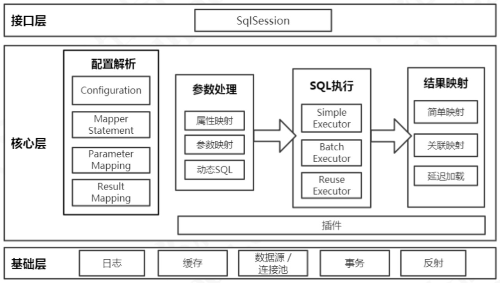
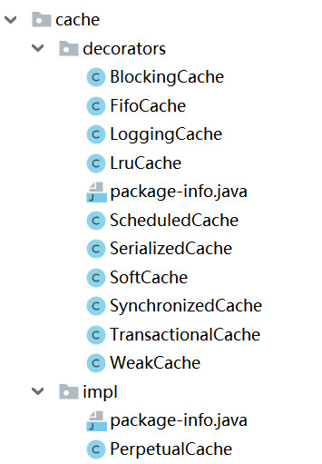
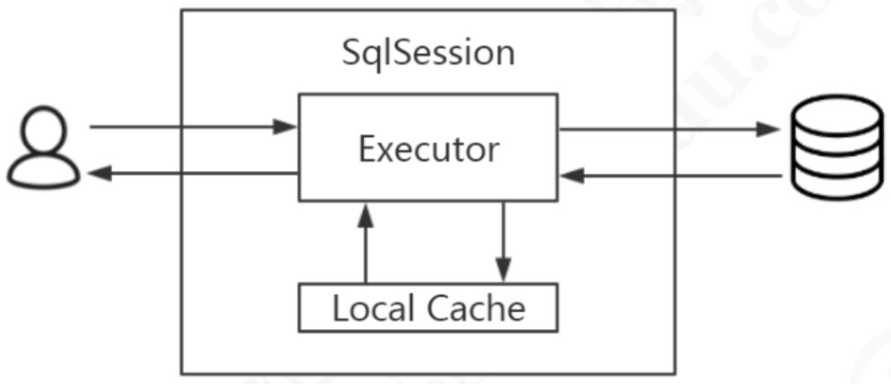
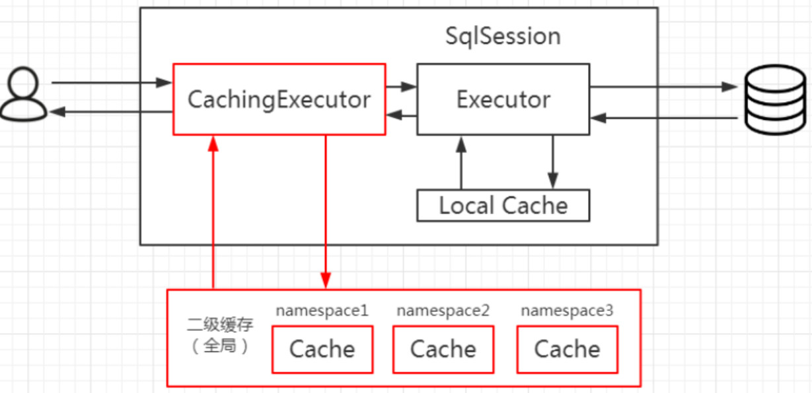

# 体系结构与工作原理(宏观架构与微观的原理)

## 核心内容

- 工作流程
- 架构分层
- 缓存与数据源详解
- 源码解读
- 设计模式与核心对象总结

## 涉及的详细内容

- [主要工作流程](#MyBatis的工作流程分析)
- [架构分层以及模块划分](#架构分层以及模块划分)
- [缓存机制](#MyBatis缓存机制)
- [底层工作原理与设计思想](#底层工作原理与设计思想)

## MyBatis的工作流程分析

### 涉及的类
Configuration: 由全局配置文件以及Mapper配置生成；
SqlSessionFactory: 由Configuration生成；
SqlSession: 由SqlSessionFactory生成；
Executor: 由SqlSession内部持有，这个执行器完成对DB的操作；
StatementHanler: 处理入参、结果等操作；

### 工作流程简述
1. 解析配置文件；
2. 创建工厂类；
3. 创建会话；
4. 调用会话操作数据库；

## 架构分层以及模块划分
1. 提供给应用使用：接口层，Mybatis提供给应用层访问，由应用直接使用；
2. 处理数据库操作：核心层，Mybatis内部真正干活的，操作数据库；
3. 支持工作：基础层，功能的提取，用于复用，比如日志，它可以供接口层和核心层使用；


## MyBatis缓存机制
> 缓存对象什么时候创建？什么情况下被装饰？

Mybatis只有一种默认的实现-PerpetualCache（一级缓存与二级缓存），同时也提供了一系列的装饰类，用于对基本缓存层层装饰，提供新的功能。如LruCache代表最近最少使用淘汰机制的缓存。



### 一级缓存(默认开启)
作用域：SqlSession-会话内共享；
存放位置：org.apache.ibatis.executor.BaseExecutor#localCache

```java
// 每创建一个会话，就会创建一个执行器，而执行器中带有缓存。
protected BaseExecutor(Configuration configuration, Transaction transaction) {
    this.transaction = transaction;
    this.deferredLoads = new ConcurrentLinkedQueue<>();
    this.localCache = new PerpetualCache("LocalCache");
    this.localOutputParameterCache = new PerpetualCache("LocalOutputParameterCache");
    this.closed = false;
    this.configuration = configuration;
    this.wrapper = this;
  }
```


##### 一级缓存何时失效?
insert,delete,update标签上的flushCache属性值默认是true。
一级缓存会引发什么问题？
脏数据访问，当不同的sqlSession在访问同一条数据的时候，A先取出数据，后B修改器数据，并更新到数据库中，这个时候A再次查询数据，就是缓存过的数据，其实这个数据还没有被修改；
如何解决脏数据的问题？
使用二级缓存；


### 二级缓存(默认开启)
作用域：namespace(某个Mapper的内部共享缓存)；因为一个Mapper对应一个interface，所以如果启用二级缓存，那么同一个interface中的所有方法共享二级缓存。
> 二级缓存应该工作在一级缓存之前还是之后？
> 答：之前，因为二级缓存的作用范围更广。

存放位置：org.apache.ibatis.executor.CachingExecutor#tcm
如果开启了二级缓存，则会使用CachingExecutor对BaseExecutor进行装饰（二级缓存的原理）。


##### 如何开启二级缓存
```xml
<!-- 第一个标签-->
<setting name="cacheEnabled" value="true"/>
<!-- 第二个标签，Mapper.xml文件中配置-->
<cache/>
```

##### 如何关闭二级缓存
第一种方式:
```xml
<setting name="cacheEnabled" value="false"/>
```
第二种方式（单个方法级别）：
selec标签上的useCache设定为false.

##### 二级缓存什么时候开启?
- 以查询为主的应用中使用（频繁的删除二级缓存会失去它的意义）
> 如何让多个namespace去共享二级缓存？


#### 缓存淘汰算法
LRU：最近最少使用(默认使用)
FIFO: 
WEAK: 基于WeakReference
SOFT: 基于SoftReference


