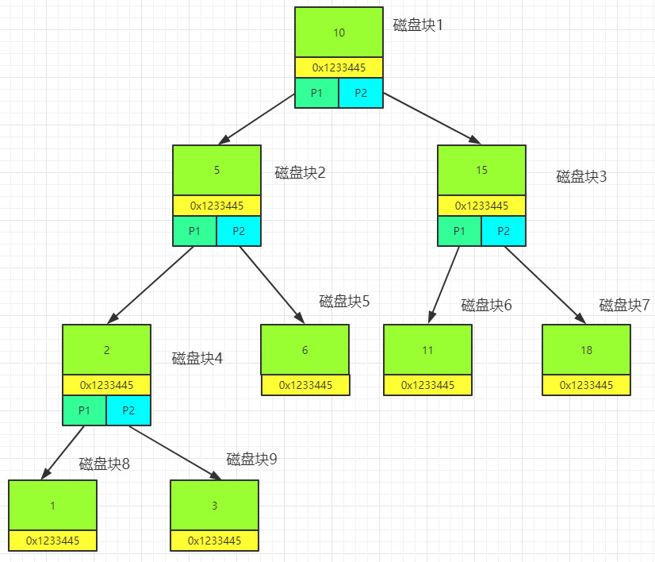
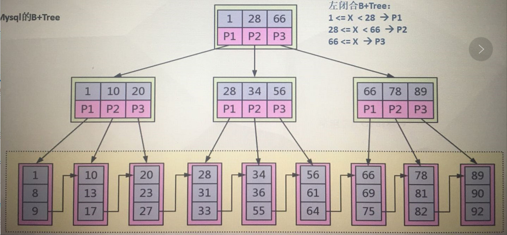

# 数据库索引

### 目录

1. 索引是谁实现的？
2. 索引的定义？
3. 为什么选择B+Tree？
4. B+Tree在两大引擎中如何体现？
5. 索引知识补充
6. 总结及验证

### 索引是谁实现的

插拔式的存储引擎实现， Mysql的核心模块并不包含索引。

### 索引的定义

> 正确的创建合适的索引，是优化查询的关键

#### 概念

索引是为了**加速对表中数据库行的检索**而创建的一种分散存储的**数据结构**；索引在磁盘中（一部分存储在缓存中）。

### 为什么要有索引？

1. 索引能极大的减少存储引擎需要扫描的数据量
2. 索引可以把随机IO变成顺序IO
3. 索引可以帮助我们在进行分组、排序等操作时，避免使用临时表

### 为什么选择B+Tree

#### 二叉查找树

二叉树容易形成线性链表；检索的方式相当于全表扫描；

如果使用二叉树作为索引结果，那么检索效率完全取决于数据插入的顺序；

#### 平衡二叉树

平衡二叉树在数据插入与删除时，做了相应的旋转，保证树的平衡性；

**特点**: 树的左右子节点高度差不超过1；

查找规律： 如果查找6这个节点，首先需要把根节点10所在的磁盘块加载到内存中，进行比对，发现小于10，则取磁盘块1的左子节点对应的磁盘块2，发现值大于5，则取磁盘块的右子节点磁盘块5，发现该磁盘块中的值为6相等，则结束查询。

##### 平衡二叉树的缺点

1. 树太深了。

   数据处的深度，决定**IO**的次数，IO操作耗时大；

2. 值太少了。

   每一个磁盘块(节点/页)保存的数据量太少了-每做一次IO，仅取出一个节点的数据；

   - 没有很好利用操作磁盘IO的数据交换特性
     - 一次IO操作，数据是4KB(一页)，但是节点中的数据根本就没有4KB；
   - 没有利用好磁盘IO的预读能力（空间局部性原理），从而带来频繁的IO操作；
     - 比如读一个2MB的文件，操作系统在第一次读取了4kb之后，会认为你接下来马上要读取下一页数据，所以提前给你预读16k(Mysql预读1页就是16k),或者24k.

##### B-Tree 多路平衡查找树(绝对平衡)

多路平衡： 节点存在多个子节点(超过2个) ；

查找流程：

1. 把根节点数据加载到内存中，将要查找的数据与节点数据进行对比；
2. 根据数据的值，以及节点中的数据，决定要从哪个分支上查找数据；

假设Mysql的一个数据页为16kb, 那么一个Int型的数据占用4个字节，最终一个节点上可以存储多少个ID值？16 *1024 /4； 这将取决于它能有多少路(多少个节点)； 如果把手机号加索引，那么一个数据页能存放的数据大大就减少了，这个时候就会拖垮数据结构的路数。

> Mysql是几路的？ 这取决于索引字段数据的大小。

B-Tree 的结构，大大提高了对操作系统数据交换特性以及空间局部性的利用。所以这种结构特别适用于数据库的索引；

绝对平衡：所有叶子节点的高度一致；

##### B+Tree 

##### B+Tree 与B-Tree的区别

1. B+节点关键字搜索采用闭合空间；
   - **左闭合区间**： 即使从支节点中匹配到了关键字，它也会继续向下搜索，一直搜索到叶子节点；
2. B+非叶子节点不保存数据相关信息，只保存关键字和子节点的引用；
   - 每个支节点只保存关键字与引用，不保存数据值，这种情况，每个页能存下的关键字就更多了；
3. B+关键字对应的数据保存在叶子节点中；
4. B+叶子节点是顺序排序的，并且相邻节点具有顺序引用的关系；
   - 前一个叶子节点的最后一个数据会指向当前叶子节点的第一个数据，这样就可以保证数据是有顺序的(数据天然具备排序能力)。

##### 为什么选用B+Tree

- B+树是B-树的变种，多路绝对平衡查找树，拥有B-树的优势；
- B+树扫库、表能力更强；
  - 在B树中如果要扫表，那么它必须经过扫过整棵索引树中的每个节点；
  - 在B+树中，扫表只需要扫叶子节点所在的数据区就可以了，由于它的叶子节点之间有关联，所以扫描数据的时候，不需要再去扫支节点。
- B+树的磁盘读写能力更强；
  - B+树的支节点上不保存数据值，所以能够加载的关键字更多。
- B+树的排序能力更强；
  - 叶子节点的关联关系，天生拥有排序性能。
- B+树的查询效率更加稳定；
  - 在B树中，查询的效率取决于可匹配数据的节点所在的高度，如果高度为树的深度，那么很快就能被查出来，如果节点的高度为1，那么查询就需要经过所有层，一直到叶子节点，寻址不稳定。
  - 在B+树中，每次查询都需要经过所有层，达到叶子节点，才能查出数据。

### Mysql B+Tree索引体现形式

#### Myisam 索引实现

##### Myisam 索引是如何实现的？

. frm文件： 表结构定义文件；

Myisam 中索引存储的特点：数据保存在.MYD文件中，而索引保存在.MYI文件中。

叶子节点保存的数据是表的某行记录所在物理磁盘地址，根据该地址，可以从MYD中查出对应的数据。

##### Myisam主键索引与普通索引的存储

 

#### Innodb 索引实现

innodb 索引是如何实现的？

> 以主键为索引来组织数据的存储。如果没有创建主键，存储引擎会自动创建一个隐式的主键(6byte)。

.IBD 文件：索引+数据;

聚集索引：数据库表示行中数据的物理顺序与键值的逻辑(索引)顺序相同。

在B+树中，数据是保存在叶子节点上的。

##### 辅助索引是如何查找数据的？

根据辅助索引找到叶子节点上的ID值，再从主键索引中，找到对应的记录。

为什么Innodb不像Myisam一样把辅助索引的叶子上存储记录所在的物理磁盘地址，而存储主键的值？

答： 以免发生数据迁移时，只需要修改主键索引中的记录，而辅助索引中的记录只要保证id值不变，它就不需要发生修改。

##### Inoodb Vs Myisam 

1. Innodb 数据和索引放在一起；而Myisam数据和索引分成了两个文件；

1. Innodb 数据放在叶节点，而Myisam数据放在其他地方，由索引的叶子节点指向；
