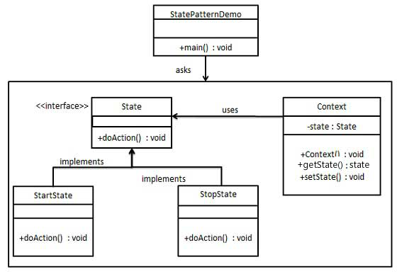

# 状态模式


## 概述

- 某个对象的行为，因其内在状态的改变，行为需要发生改变，当使用该对象时，需要针对其获取其相应行为，这种情况适合状态模式；

- 允许对象在内部状态发生改变时改变它的行为，对象看起来好像修改了它的类。

- 状态模式主要解决的是当控制一个对象状态转换的条件表达式（过多的if...else...用于判断其状态转换）过于复杂时的情况，把状态的判断逻辑转移到表示不同状态的一系列类当中，可以把复杂的判断逻辑化。


## 优点

- 避免过多switch...case或者if...else语句的使用，避免了程序的复杂性，提高系统的可维护性。
- 将特定的状态相关的行为都放入一个对象中，由于所有与状态相关的代码都存在某个状态实现类中（ConcreteSate)，所以通过新的子类可以很容易地增加新的状态和转换；
- 状态模式将各种状态转移逻辑分布到State的子类之间（消除了庞大的条件分钟语句），来减少相互间的依赖；
- 封装性较好，状态变更防止到类的内部来实现，外部的调用不用知道类内部是如何实现状态和行为的变换的。


## 缺点

- 容易产生类膨胀，如果一个事务需要非常多的状态，那么子类太多不容易管理（状态最好不超过5个）；

- 对开闭原则并不友好，如果需要增加状态，那么需要在抽象状态类增加对应的方法，否则无法实现对新状态的过渡，如果新增了方法，则其他状态均需要增加对应的实现方法-包含过渡方法，或者禁止状态变更操作。


## 角色

State - 抽象状态角色，接口或抽象类，负责对象状态定义，并且封装环境角色以实现状态切换。

ConcreteState - 具体状态角色，每一个具体状态必须完成两个职责：

1. 本状态的行为管理（当前状态需要完成的业务逻辑）；

2. 趋向状态处理（当前状态如何过度到其他状态）；

Context - 环境角色，定义客户端需要的接口，并且负责具体状态的切换。


## UML图




## 难点

- 当前状态与上下文环境的关系控制；
- 某个具体状态在处理状态切换；

状态模式相对来说比较复杂，它提供了一种对物质运动的另一个观察视角，通过状态变化促使行为的变化（行为都是抽象的，这里说明一点，各个状态皆具有对所有状态下的业务逻辑处理-包含某个操作对下一个状态进行过渡）；


## 使用场景

- 行为随状态改变而改变的场景
- 条件、分支判断语句的替代者

-在程序中大量使用switch语句或者if判断语句会导致程序结构不清晰，状态模式通过扩展子类实现了条件的判断处理。


## 为什么要使用状态模式

以下实例未使用状态模式：

```java
package com.designpattern.state.common;
/**
* 听音乐的流程
*/
public class ListenMusic {
	public void start(){
		System.out.println("开始/继续播放");
	}
	public void pause(){
		System.out.println("暂停播放...pause!");
	}
	public void speedUp(){
		System.out.println("快进...speedUp!");
	}
	public void stop(){
		System.out.println("结束播放...stop!");
	}
}
```

测试用例：

```java
    1 package com.designpattern.state.common;
    2 
    3 public class Test {
    4         public static void main(String[] args) {
    5                 ListenMusic listenMusic = new ListenMusic();
    6                 listenMusic.start();
    7                 listenMusic.speedUp();
    8                 listenMusic.pause();
    9                 listenMusic.stop();
   10         }
   11 }
```

以上写法的缺点有两个：

1. 播放音乐在stop之后状态，能够快进吗？显然是不能的，这里就不能做到限制在某个状态能够做哪些事，当然是可以在每个方法(speedUp,stop..)中就当前状态进行判断，限制其行为，但是这样就触发了第二个问题；
2. 这样的写法违反了开闭原则，如果对某个状态具体的行为进行修改，则会影响到其ListenMusic中的方法，而这个类涉及的范围太大，容易对其他状态下的行为，造成影响；另外，如果要增加一个状态，势必也需要修改ListenMusic方法，这样就无法对扩展开放；

 

## 使用状态模式进行改进

抽象状态：

```java
    1 package com.designpattern.state;
    2 
    3 /**
    4  * 状态
    5  */
    6 interface State {
    7         /**
    8      * 播放
    9      */
   10         void play();
   11 
   12         /**
   13      * 暂停
   14      */
   15         void pause();
   16 
   17         /**
   18      * 停止播放
   19      */
   20         void stop();
   21 }
```

播放状态：

```java
    1 package com.designpattern.state;
    2 
    3 public class PlayState implements State{
    4         @Override
    5         public void play() {
    6                 System.out.println("重复播放...");
    7         }
    8 
    9         @Override
   10         public void pause() {
   11                 System.out.println("已暂停...");
   12         }
   13 
   14         @Override
   15         public void stop() {
   16                 System.out.println("已停止..");
   17         }
   18 }

```

暂停状态：

```java
    1 package com.designpattern.state;
    2 
    3 public class PauseState implements State{
    4         @Override
    5         public void play() {
    6                 System.out.println("继续播放...");
    7         }
    8 
    9         @Override
   10         public void pause() {
   11                 System.out.println("重复暂停...");
   12         }
   13 
   14         @Override
   15         public void stop() {
   16                 System.out.println("已停止...");
   17         }
   18 }
```


