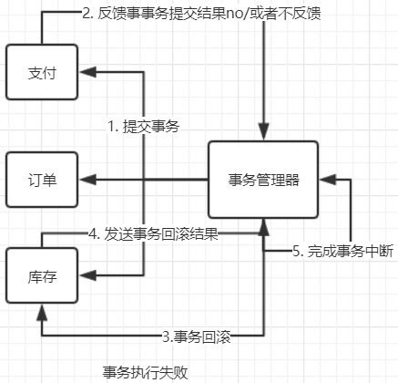

# 分布式事务

## 概要

- 事务简介
- 分布式事务的前世今生
- 分布式事务的解决方案
- 主流分布式事务框架

## 事务简介

- 事务是用来保证一组数据操作的完整性和一致性
举例：扣减库存->下订单->支付，任何一个操作失败了，其他两个操作都不会成功。
- 事务必须满足ACID的四大特性
	- 原子性
		一个事务内的操作是不可分割的。// TODO
	- 一致性
		一个事务内的操作，要么全部成功，要么全部失败。
		A（原有500元） 转账给 B（原有0元）300元，结果要么是A有200而B有300，要么是A有500而B有0元。
	- 隔离性
		两个事务之间是隔离的，互不影响。
	- 持久性
		事务的执行结果是可持久化的。
		
	> 原子性和一致性的区别？
- 事务具有四种隔离级别
- 事务具有七种传播行为

## 分布式事务

### 概念
- 分布式事务就是将多个节点（一台机器或者是一个服务）的事务看成一个整体处理。
- 分布式事务由事务参与者，资源服务器，事务管理器等组成。
- 常见的分布式事务的例子：支付，下订单等。

### 实现思路

- 两段式事务(2PC)和三段式事务(3PC)
- 基于XA的分布式事务（一般不用于分布式事务）
- 基于消息的最终一致性方案（借用MQ和Redis缓存）
- TCC编程式补偿性事务

### 两段式事务(2PC)

#### 事务的组成

由事务协调者以及各个服务组成；
第一阶段：准备阶段

第二阶段：提交阶段

#### 2PC的有点：
实现简单
#### 2PC的缺点：
单点问题：事务协调者如果宕机，整个事务就不能工作；
同步阻塞：只有事务中涉及的其中一台机器反馈缓慢，其他机器都会同步阻塞来等待返回结果。
数据不一致：如果没有过期时间来判断第二阶段每个节点对commit反馈的处理，假如单个服务宕机，当时它还没来得及回复commit，那么事务协调器要么根据过期时间来判断是否要回滚（这个过期时间要如何设定？设定的不好的话，会导致其他机器同步阻塞，浪费性能），要么直接执行事务提交（最终导致数据不一致，因为宕机的服务有可能还未完成事务提交）。

### 三段式事务(3PC)

#### 事务的组成
同2PC相同，它是基于2PC改进的。

第一阶段(canCommit)：
协调者询问各个服务是否可以进行事务？如果协调者都回复Yes，则进入预备状态；
第二阶段(preCommit)：
协调者发送预提交请求，参与者接收到请求后，会执行事务操作，并反馈事务执行结果；
第三阶段(doCommit)：
该阶段将进行真正的事务提交，协调者发起事务提交的请求，各个参与者提交请求，并反馈结果，只要协调者收到一个No的回复，或者时间超时，都将执行事务回滚。
#### 3PC的优点
- 相较于2PC，3PC最大的优点是降低参与者的阻塞范围，我理解的就是，在二阶段提交之前有一个canCommit的询问，这样如果有单点故障问题，可以尽早被发现。
- 避免协调者单点问题，阶段3中协调者出现问题时，参与者会继续提交事务。

#### 3PC的缺点
- 就是由于3PC解决了单点问题，阶段3中协调者出现问题时，参与者会继续提交事务（其他参与者有可能因为本身事务执行失败了，而不能提交事务），会导致数据不一致性。

### 基于XA的分布式事务

XA事务是基于两阶段提交协议的，所以需要有一个事务协调者（transaction manager）来保证所有的事务参与者都完成了准备工作(第一阶段)。如果事务协调者（transaction manager）收到所有参与者都准备好的消息，就会通知所有的事务都可以提交了（第二阶段）。MySQL或者Oracle 在这个XA事务中扮演的是参与者的角色，而不是事务协调者（transaction manager）。

### 基于消息的解决方案（应用比较广泛）
以RocketMQ的事务实现进行说明:
1. 生产者发送半消息到MQ中（这时MQ认为该消息还不能向消费者推送）；
2. MQ返回发送结果给生产者；
3. 生产者执行本地事务，并将结果（commit/rollback）发送到MQ，MQ接收到commit消息之后，标记该消息已经可以推送给消费者了。
4. 如果MQ接收到rollback结果，则不投递消息，并且三天后删除该消息。
5. 如果MQ长时间没有接收到事务的执行结果，则进行回查， 得到执行结果。
6. MQ将消息投递给消费者。

流程图：

总结：个人认为，其实基于MQ的分布式事务，很好的利用了MQ这个平台：
1. 首先,MQ大概率上不会宕机，那么作为协调者的MQ，如果可以保证协调者的高可用，可以排除3PC中的数据一致性问题。
2. 基于MQ的回查机制，如果单点服务出现问题，协调者可以直到，并且事务依然可以进行回滚（这个地方涉及了MQ生产者组的问题）。

### TCC补偿性事务实现

T: try 尝试执行
C: confirm 确认
C: cancel 取消

#### 流程图

#### 基本原理
尝试执行：执行之后，要确认是否成功乎或者取消。
TCC的核心：TCC与二阶段提交的最大不同之处在于，二阶段只有一个事务执行，以及提交或者回滚操作，如果事务失败了，就回滚，反之则提交。而TCC提供了三个接口，用于尝试执行，以及确认和取消操作，尝试执行由业务系统调用，而确认执行和取消操作由事务协调者调用，其实业务系统或者协调者根本不在乎参与者所实现的这三个接口里面执行了什么，反正最终的结果就是，如果事务回滚了，就执行各个参与者的cancel方法就对了。假如对应A服务为订单服务，那么在执行try方法之后，如果创建了这条订单，那么在执行cancel之后，这条订单就要被删除。

### 总结

#### 两种事务比较
- 基于消息事务是强一致性事务，但是会存在资源浪费（会存在等待的情况），适用于金钱相关的场景；
- TCC事务是柔性事务，在try阶段要对资源做预留
- TCC事务在确认或取消阶段释放资源
- 与MQ事务对比，TCC的时效性更好（比如说，A服务刚下了5个单子，但是B服务已经扣减了20个库存，它们之间不相互依赖，只要保证执行cancel的时候，创建的单子要消除掉，以及扣减的库存要重新上架等。）

### 分布式事务框架

- 全局事务服务(GTS)
- 蚂蚁金服分布式事务(DTX)
- 基于TCC的TCC-transaction
- ByteTCC
- Seata
