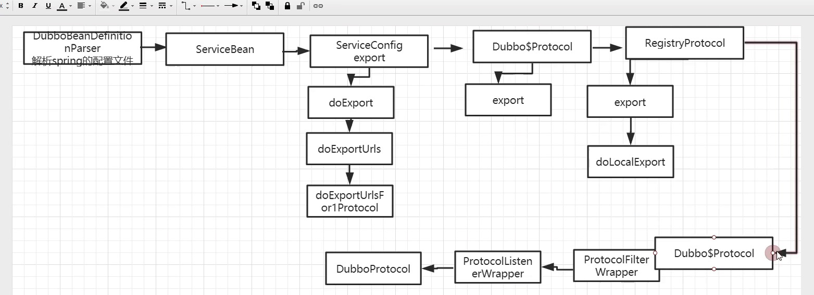

## Dubbo 服务发布


>  发布过程 : 解析配置文件，IP地址和端口号暴露出去；

> Dubbo 的配置文件dubbo.xsd  是基于Spring进行扩展的，Spring提供了一种机制进行标签扩展 - NamesapceHandler，BeanDefinitionParse; 通过这两个接口去实现自定义扩展；

1. 加载/META-INF/spring.handles文件；

2. DubboNamespaceHandler文件内容如下：

   ```java
   public class DubboNamespaceHandler extends NamespaceHandlerSupport {
   
       static {
           Version.checkDuplicate(DubboNamespaceHandler.class);
       }
   
       @Override
       public void init() {
           registerBeanDefinitionParser("application", new DubboBeanDefinitionParser(ApplicationConfig.class, true));
           registerBeanDefinitionParser("module", new DubboBeanDefinitionParser(ModuleConfig.class, true));
   				...
       }
   
   }
   ```

3. Spring在提供的NameHandler机制，（在什么时候调用？）在调用init方法时，配置解析对应标签的解析器；

> Spring将解析bean之后的数据保存到对应的对象中如ModuleConfig, ApplicationConfig...


#### ServiceBean的实现

首先看ServiceBean的定义：

```java
public class ServiceBean<T> extends ServiceConfig<T> implements InitializingBean, DisposableBean,ApplicationContextAware, ApplicationListener<ContextRefreshedEvent>, BeanNameAware,ApplicationEventPublisherAware
```

- InitializingBean : bean初始化的时候调用afterPropertiesSet方法；
- DisposableBean : bean销毁时执行其destroy方法；

ServiceBean在初始化之后，调用其afterProperties方法：

```java
public void afterPropertiesSet() throws Exception {
  	...
    if (!supportedApplicationListener) {
      	export();
    }
}
```

export方法实现如下：

```java
    @Override
    public void export() {
      	// 发布服务
        super.export();
        // 发布服务暴露事件
        publishExportEvent();
    }
```

最终执行ServiceConfig的export方法(ServiceBean继承自ServiceConfig)

```java
    public synchronized void export() {
        checkAndUpdateSubConfigs();
        if (!shouldExport()) {
            return;
        }
        if (shouldDelay()) {// 需要延迟暴露服务的情况
            delayExportExecutor.schedule(this::doExport, delay, TimeUnit.MILLISECONDS);
        } else {
            doExport();
        }
    }
```

doExport方法实现如下：

```java
    protected synchronized void doExport() {
        if (unexported) {
            throw new IllegalStateException("The service " + interfaceClass.getName() + " has already unexported!");
        }
        if (exported) { // 已经暴露过了，就不需要重复暴露了
            return;
        }
        exported = true;

        if (StringUtils.isEmpty(path)) {
          	// 路径名 = 接口名
            path = interfaceName;
        }
        String uniqueServiceName = getUniqueServiceName();
        ProviderModel providerModel = new ProviderModel(uniqueServiceName, ref, interfaceClass);
        ApplicationModel.initProviderModel(uniqueServiceName, providerModel);
        doExportUrls();
    }
```

doExportUrls();实现如下：

```java
    private void doExportUrls() {
      	// dubbo的配置文件中可以配置多个注册中心
      	// <dubbo:registry/>
      	// <dubbo:registry/>
        List<URL> registryURLs = loadRegistries(true);
				// dubbo支持多协议发布
      	// <dubbo:protocol/>
        for (ProtocolConfig protocolConfig : protocols) {
            doExportUrlsFor1Protocol(protocolConfig, registryURLs);
        }
    }
```

> 启动一个服务需要做什么？调用注册中心发布服务到zk,启动一个Netty服务

doExportUrlsFor1Protocol方法实现如下：

```java
    private void doExportUrlsFor1Protocol(ProtocolConfig protocolConfig, List<URL> registryURLs) {
        String name = protocolConfig.getName();
        if (StringUtils.isEmpty(name)) {
            name = Constants.DUBBO;
        }

        Map<String, String> map = new HashMap<String, String>();
        map.put(Constants.SIDE_KEY, Constants.PROVIDER_SIDE);
        appendRuntimeParameters(map);
        appendParameters(map, application);
        appendParameters(map, module);
        appendParameters(map, provider, Constants.DEFAULT_KEY);
        appendParameters(map, protocolConfig);
        appendParameters(map, this);
      	// 处理methods相关...
  			// end of methods for
        }

        if (ProtocolUtils.isGeneric(generic)) {
            map.put(Constants.GENERIC_KEY, generic);
            map.put(Constants.METHODS_KEY, Constants.ANY_VALUE);
        } else {
            String revision = Version.getVersion(interfaceClass, version);
            if (revision != null && revision.length() > 0) {
                map.put("revision", revision);
            }

            String[] methods = Wrapper.getWrapper(interfaceClass).getMethodNames();
            if (methods.length == 0) {
                logger.warn("No method found in service interface " + interfaceClass.getName());
                map.put(Constants.METHODS_KEY, Constants.ANY_VALUE);
            } else {
                map.put(Constants.METHODS_KEY, StringUtils.join(new HashSet<String>(Arrays.asList(methods)), ","));
            }
        }
        if (!ConfigUtils.isEmpty(token)) {
            if (ConfigUtils.isDefault(token)) {
                map.put(Constants.TOKEN_KEY, UUID.randomUUID().toString());
            } else {
                map.put(Constants.TOKEN_KEY, token);
            }
        }
        // export service
        String contextPath = protocolConfig.getContextpath();
        if (StringUtils.isEmpty(contextPath) && provider != null) {
            contextPath = provider.getContextpath();
        }
				// 1. 获取host
        String host = this.findConfigedHosts(protocolConfig, registryURLs, map);
			  // 2. 获取端口号
        Integer port = this.findConfigedPorts(protocolConfig, name, map);
				// 3. 将map中的数据转换成url, map中的数据就是interface,delay,application,side...等
        URL url = new URL(name, host, port, (StringUtils.isEmpty(contextPath) ? "" : contextPath + "/") + path, map);

        if (ExtensionLoader.getExtensionLoader(ConfiguratorFactory.class)
                .hasExtension(url.getProtocol())) {
            url = ExtensionLoader.getExtensionLoader(ConfiguratorFactory.class)
                    .getExtension(url.getProtocol()).getConfigurator(url).configure(url);
        }
				// 4. 从url中拿出scope
        String scope = url.getParameter(Constants.SCOPE_KEY);
        // don't export when none is configured
        if (!Constants.SCOPE_NONE.equalsIgnoreCase(scope)) {

            // 5.1 如果配置的scope不是remote，就直接发布服务到本地
            if (!Constants.SCOPE_REMOTE.equalsIgnoreCase(scope)) {
                exportLocal(url);
            }
            // 5.2 如果配置的scope不是local, 就直接发布到远程 
            if (!Constants.SCOPE_LOCAL.equalsIgnoreCase(scope)) {
                if (logger.isInfoEnabled()) {
                    logger.info("Export dubbo service " + interfaceClass.getName() + " to url " + url);
                }
                if (CollectionUtils.isNotEmpty(registryURLs)) {
                    for (URL registryURL : registryURLs) { // 多注册中心发布
                        url = url.addParameterIfAbsent(Constants.DYNAMIC_KEY, registryURL.getParameter(Constants.DYNAMIC_KEY));
                        URL monitorUrl = loadMonitor(registryURL);
                        if (monitorUrl != null) {
                            url = url.addParameterAndEncoded(Constants.MONITOR_KEY, monitorUrl.toFullString());
                        }
                        
                        // For providers, this is used to enable custom proxy to generate invoker
                        String proxy = url.getParameter(Constants.PROXY_KEY);
                        if (StringUtils.isNotEmpty(proxy)) {
                            registryURL = registryURL.addParameter(Constants.PROXY_KEY, proxy);
                        }
												// 
                        Invoker<?> invoker = proxyFactory.getInvoker(ref, (Class) interfaceClass, registryURL.addParameterAndEncoded(Constants.EXPORT_KEY, url.toFullString()));
                        DelegateProviderMetaDataInvoker wrapperInvoker = new DelegateProviderMetaDataInvoker(invoker, this);
												// protocol = Protocol$Adaptive
                        // protocol.export内部实现为：
                      //ExtensionLoader.getExtensionLoader(Protocol.class).getExtension("registry")
                        Exporter<?> exporter = protocol.export(wrapperInvoker);
                        exporters.add(exporter);
                    }
                } else {
                    Invoker<?> invoker = proxyFactory.getInvoker(ref, (Class) interfaceClass, url);
                    DelegateProviderMetaDataInvoker wrapperInvoker = new DelegateProviderMetaDataInvoker(invoker, this);

                    Exporter<?> exporter = protocol.export(wrapperInvoker);
                    exporters.add(exporter);
                }
                /**
                 * @since 2.7.0
                 * ServiceData Store
                 */
                MetadataReportService metadataReportService = null;
                if ((metadataReportService = getMetadataReportService()) != null) {
                    metadataReportService.publishProvider(url);
                }
            }
        }
        this.urls.add(url);
    }
```

服务暴露的核心点是：

```java
// protocol = Protocol$Adaptive
// protocol.export内部实现为：                    
// ExtensionLoader.getExtensionLoader(Protocol.class).getExtension("registry")
// 为什么是registry? wrapperInvoker里面的url中携带了“registry”
Exporter<?> exporter = protocol.export(wrapperInvoker);
// 那最终调用的是：ExtensionLoader.getExtensionLoader(Protocol.class).getExtension("registry")
```


> 获取指定扩展点与获取自适应扩展的点的区别是：
>
> - 自适应扩展点 ：暂时不知道用哪个扩展点，但是可以根据实际情况去动态匹配；
>
> - 指定扩展点：dubbo-spi指定的配置文件中, 每一行前面都有对应的指定扩展点名称，如以下；
>
>   dubbo=com……DubboPrototoc
>
>   Registry=com…..RegistryProtocol
>
> 那么最终获取的指定扩展点就需要根据getExtension方法中的参数，自动去匹配


因为指定了"regsitry"作为扩展点，所以Dubbo-spi 根据配置文件，最终匹配的是RegistryProtocol，所以最终调用的是RegistryProtocol.export方法：

```java
    @Override
    public <T> Exporter<T> export(final Invoker<T> originInvoker) throws RpcException {
        URL registryUrl = getRegistryUrl(originInvoker);
        // url to export locally
        URL providerUrl = getProviderUrl(originInvoker);

        final URL overrideSubscribeUrl = getSubscribedOverrideUrl(providerUrl);
        final OverrideListener overrideSubscribeListener = new OverrideListener(overrideSubscribeUrl, originInvoker);
        overrideListeners.put(overrideSubscribeUrl, overrideSubscribeListener);

        providerUrl = overrideUrlWithConfig(providerUrl, overrideSubscribeListener);
        //本地发布=启动服务
        final ExporterChangeableWrapper<T> exporter = doLocalExport(originInvoker, providerUrl);

        // url to registry
        final Registry registry = getRegistry(originInvoker);
        final URL registeredProviderUrl = getRegisteredProviderUrl(providerUrl, registryUrl);
        ProviderInvokerWrapper<T> providerInvokerWrapper = ProviderConsumerRegTable.registerProvider(originInvoker,
                registryUrl, registeredProviderUrl);
        //to judge if we need to delay publish
        boolean register = registeredProviderUrl.getParameter("register", true);
        if (register) {
            register(registryUrl, registeredProviderUrl);
            providerInvokerWrapper.setReg(true);
        }

        // Deprecated! Subscribe to override rules in 2.6.x or before.
        registry.subscribe(overrideSubscribeUrl, overrideSubscribeListener);

        exporter.setRegisterUrl(registeredProviderUrl);
        exporter.setSubscribeUrl(overrideSubscribeUrl);
        //Ensure that a new exporter instance is returned every time export
        return new DestroyableExporter<>(exporter);
    }
```

#### 本地暴露服务

doLocalExport方法内部实现如下：

```java
    private <T> ExporterChangeableWrapper<T> doLocalExport(final Invoker<T> originInvoker, URL providerUrl) {
        String key = getCacheKey(originInvoker);

        return (ExporterChangeableWrapper<T>) bounds.computeIfAbsent(key, s -> {
          	// 封装Invoker , 委托
            Invoker<?> invokerDelegete = new InvokerDelegate<>(originInvoker, providerUrl);
          	// 该protocol是通过set方法注入的 
          return new ExporterChangeableWrapper<>((Exporter<T>) protocol.export(invokerDelegete), originInvoker);
        });
    }
```

下面来分析下：

```java
protocol.export(invokerDelegete)
```

我们再看这个protocol在registryProtocol中的定义：

```java
public class RegistryProtocol implements Protocol {
    ...
    private Cluster cluster;
    
    private Protocol protocol;
    public void setProtocol(Protocol protocol) {
        this.protocol = protocol;
    }
    
    private RegistryFactory registryFactory;
    private ProxyFactory proxyFactory;
}
```

发现一个重要的信息，这个protocol是通过set注入进去的。

> ….




最终调用DubboProtocol中的export方法

```java
    @Override
    public <T> Exporter<T> export(Invoker<T> invoker) throws RpcException {
      	// 获取Url地址
        URL url = invoker.getUrl();

        // export service.
        String key = serviceKey(url);
        DubboExporter<T> exporter = new DubboExporter<T>(invoker, key, exporterMap);
        exporterMap.put(key, exporter);

        //export an stub service for dispatching event
        Boolean isStubSupportEvent = url.getParameter(Constants.STUB_EVENT_KEY, Constants.DEFAULT_STUB_EVENT);
        Boolean isCallbackservice = url.getParameter(Constants.IS_CALLBACK_SERVICE, false);
        if (isStubSupportEvent && !isCallbackservice) {
            String stubServiceMethods = url.getParameter(Constants.STUB_EVENT_METHODS_KEY);
            if (stubServiceMethods == null || stubServiceMethods.length() == 0) {
                if (logger.isWarnEnabled()) {
                    logger.warn(new IllegalStateException("consumer [" + url.getParameter(Constants.INTERFACE_KEY) +
                            "], has set stubproxy support event ,but no stub methods founded."));
                }

            } else {
                stubServiceMethodsMap.put(url.getServiceKey(), stubServiceMethods);
            }
        }

        openServer(url);
        optimizeSerialization(url);

        return exporter;
    }
```

先看openServer(url)的实现：

```java
    private void openServer(URL url) {
        // find server.
        String key = url.getAddress();
        //client can export a service which's only for server to invoke
        boolean isServer = url.getParameter(Constants.IS_SERVER_KEY, true);
        if (isServer) {
            ExchangeServer server = serverMap.get(key);
            if (server == null) {
                synchronized (this) {
                    server = serverMap.get(key);
                    if (server == null) {
                      	// 如果key对应的server不存在，则创建server
                        serverMap.put(key, createServer(url));
                    }
                }
            } else {
                // server supports reset, use together with override
                server.reset(url);
            }
        }
    }
```

createServer实现:

```java
    private ExchangeServer createServer(URL url) {
        
      
      url = URLBuilder.from(url)
                // send readonly event when server closes, it's enabled by default
                .addParameterIfAbsent(Constants.CHANNEL_READONLYEVENT_SENT_KEY, Boolean.TRUE.toString())
                // enable heartbeat by default
                .addParameterIfAbsent(Constants.HEARTBEAT_KEY, String.valueOf(Constants.DEFAULT_HEARTBEAT))
                .addParameter(Constants.CODEC_KEY, DubboCodec.NAME)
                .build();
        String str = url.getParameter(Constants.SERVER_KEY, Constants.DEFAULT_REMOTING_SERVER);

      
      
      
        if (str != null && str.length() > 0 && !ExtensionLoader.getExtensionLoader(Transporter.class).hasExtension(str)) {
            throw new RpcException("Unsupported server type: " + str + ", url: " + url);
        }

      	// 绑定服务
        ExchangeServer server;
        try {
            server = Exchangers.bind(url, requestHandler);
        } catch (RemotingException e) {
            throw new RpcException("Fail to start server(url: " + url + ") " + e.getMessage(), e);
        }
      
      

        str = url.getParameter(Constants.CLIENT_KEY);
        if (str != null && str.length() > 0) {
            Set<String> supportedTypes = ExtensionLoader.getExtensionLoader(Transporter.class).getSupportedExtensions();
            if (!supportedTypes.contains(str)) {
                throw new RpcException("Unsupported client type: " + str);
            }
        }

        return server;
    }
```


#### 注册到zookeeper

注册到zk上的入口是RegistryProtocol的export方法：

```java
    @Override
    public <T> Exporter<T> export(final Invoker<T> originInvoker) throws RpcException {
        URL registryUrl = getRegistryUrl(originInvoker);
        // url to export locally
        URL providerUrl = getProviderUrl(originInvoker);

        // Subscribe the override data
        // FIXME When the provider subscribes, it will affect the scene : a certain JVM exposes the service and call
        //  the same service. Because the subscribed is cached key with the name of the service, it causes the
        //  subscription information to cover.
        final URL overrideSubscribeUrl = getSubscribedOverrideUrl(providerUrl);
        final OverrideListener overrideSubscribeListener = new OverrideListener(overrideSubscribeUrl, originInvoker);
        overrideListeners.put(overrideSubscribeUrl, overrideSubscribeListener);

        providerUrl = overrideUrlWithConfig(providerUrl, overrideSubscribeListener);
        //export invoker
        final ExporterChangeableWrapper<T> exporter = doLocalExport(originInvoker, providerUrl);

        // url to registry
        final Registry registry = getRegistry(originInvoker);
        final URL registeredProviderUrl = getRegisteredProviderUrl(providerUrl, registryUrl);
        ProviderInvokerWrapper<T> providerInvokerWrapper = ProviderConsumerRegTable.registerProvider(originInvoker,
                registryUrl, registeredProviderUrl);
        //to judge if we need to delay publish
        boolean register = registeredProviderUrl.getParameter("register", true);
        if (register) {
            register(registryUrl, registeredProviderUrl);
            providerInvokerWrapper.setReg(true);
        }

        // Deprecated! Subscribe to override rules in 2.6.x or before.
        registry.subscribe(overrideSubscribeUrl, overrideSubscribeListener);

        exporter.setRegisterUrl(registeredProviderUrl);
        exporter.setSubscribeUrl(overrideSubscribeUrl);
        //Ensure that a new exporter instance is returned every time export
        return new DestroyableExporter<>(exporter);
    }
```

第一句代码比较复杂：

```java
URL registryUrl = getRegistryUrl(originInvoker);
```

内部实现如下：

```JAVA
    private URL getRegistryUrl(Invoker<?> originInvoker) {
      	// registry://...
        URL registryUrl = originInvoker.getUrl();
      	// 将registry->zookeeper://...改协议头
        if (REGISTRY_PROTOCOL.equals(registryUrl.getProtocol())) {
            String protocol = registryUrl.getParameter(REGISTRY_KEY, DEFAULT_DIRECTORY);
            registryUrl = registryUrl.setProtocol(protocol).removeParameter(REGISTRY_KEY);
        }
        return registryUrl;
    }
```


#### 远程暴露服务

