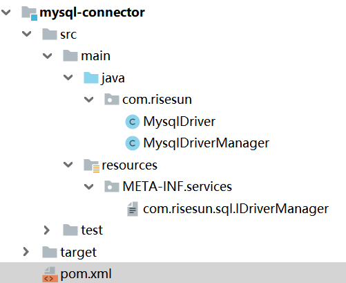
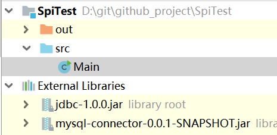
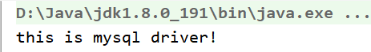
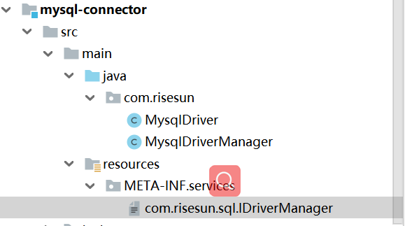
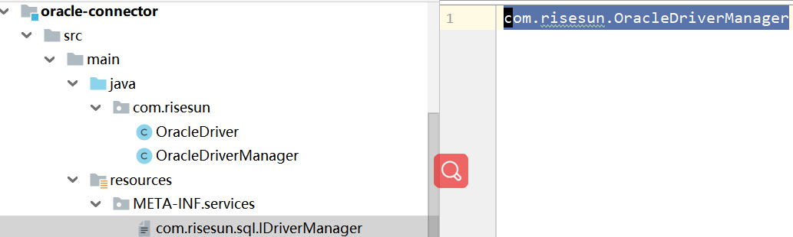
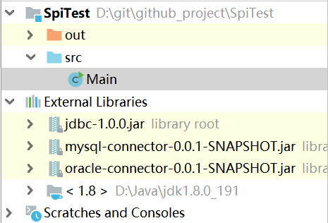
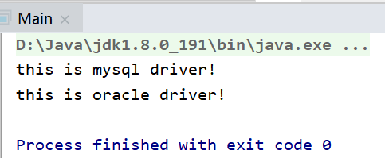

# Java SPI

- [概念](#概念) 
- [代码示例](#代码示例)
- [总结](#总结)


## 概念

SPI(Service Provider Interface)是Java提供的一套用来被第三方实现或者扩展的API，为某个接口寻找服务实现的机制，它可以用来启用框架扩展和替换组件，其目的是解耦。


## 代码示例

我们以数据库驱动加载的例子来认识以下SPI。（JDK的sql包中提供过了Driver与DriverManager类，但是为了简单，我们采用完全自定义的方式直入SPI的使用场景。)

JDK中有提供数据库驱动(Driver)的定义（暂且认为以下为JDK的提供的抽象接口）

```java
/**
 * 驱动
 */
public abstract class AbstractDriver {
    public abstract String getName();
}
```

数据库驱动管理器(DriverManager)

```java
/**
 * 驱动管理器
 */
public interface IDriverManager {
    /**
     * 获取驱动
     * @return
     */
    AbstractDriver getDriver();
}
```

它是个接口，因为各个厂商(Mysql, Oracle有各自的实现)，接口相当于定义了规范，那么具体的实现如果由jdk提供，那就无法体现解耦的思想，也不能解决后续的扩展问题。

接下来要做什么？没了。这就没了？是的，规范已经定义好了，具体的实现要靠厂商自己来实现。

Mysql提供的包内容如下：



首先它提供了具体的驱动实现，同时它也提供了自己的驱动管理器实现。我们先来看下这两个东西。

MysqlDriver (mysql驱动实现)

```java
package com.risesun;

import com.risesun.sql.AbstractDriver;

public class MysqlDriver extends AbstractDriver {
    @Override
    public String getName() {
        return "this is mysql driver!";
    }
}
```

MysqlDriverManager(mysql驱动管理器实现）

```java
package com.risesun;

import com.risesun.sql.AbstractDriver;
import com.risesun.sql.IDriverManager;

public class MysqlDriverManager implements IDriverManager {
    @Override
    public AbstractDriver getDriver() {
        return new MysqlDriver();
    }
}
```

其实我们看它就仅仅提供了驱动以及驱动管理器的具体实现类。这个时候，我们从JDK的角度去使用mysql的驱动实现相关类。



如果要使用Mysql的东西，那当然要引入对应的包，那我们就把上一步Mysql相关的类打包之后，引入到具体的实现中，我们来看看具体使用的代码。

```java
import com.risesun.sql.IDriverManager;

import java.util.Iterator;
import java.util.ServiceLoader;

public class Main {
    static ServiceLoader<IDriverManager> load = ServiceLoader.load(IDriverManager.class);
    public static void main(String[] args) {
        Iterator<IDriverManager> iterator = load.iterator();
        while(iterator.hasNext()){
            IDriverManager driverManager = iterator.next();
            System.out.println(driverManager.getDriver().getName());
        }
    }
}
```

输出：



刚刚发生了什么？原来引入了mysql提供的相关包，就能正常使用到mysql提供的驱动相关的功能了。因为以上代码并没有涉及到具体的实现（解耦）。我们可以看到核心的代码是：

```java
static ServiceLoader<IDriverManager> load = ServiceLoader.load(IDriverManager.class);
```

这句话做了什么？它会从引入的包（mysql-connector-0.0.1-SNAPSHOT）中的获取到某个文件中提供的驱动实现类（看起来里面具有寻找实现类的某种规则）。



这个文件就在resources/META-INF/services/目录下，我们发现它的文件名和我们jdk（暂且认为文章开头提供的AbstractDriver和IDriverManager都是jdk提供的）提供的IDriverManager接口全路径名保持一致，我们再看文件里面的内容：

```java
com.risesun.MysqlDriverManager
```

它就是mysql提供的驱动实现类的全路径名，原来这个规则就这么简单，那我们应该模拟下oracle的驱动实现：

OracleDriver

```java
package com.risesun;

import com.risesun.sql.AbstractDriver;

public class OracleDriver extends AbstractDriver {

    @Override
    public String getName() {
        return "this is oracle driver!";
    }
}
```

OracleDriverManager

```java
package com.risesun;

import com.risesun.sql.AbstractDriver;
import com.risesun.sql.IDriverManager;

public class OracleDriverManager implements IDriverManager {
    @Override
    public AbstractDriver getDriver() {
        return new OracleDriver();
    }
}
```

最后遵守其规则，对应的目录下创建相关文件：



最后打包，并引入到SpiTest工程中去使用，这个时候，SpiTest工程如下所示（与之前的区别是多引入了一个包）：



我们再执行Main方法 输出：



原来最终要达到的效果是，只要引入相关的包，就可以使用相关的实现，那如果有其他的厂商只需要引入对应的包就可以了，而SpiTest只关注顶层接口的使用，它是基于接口编程的。因为我们在使用的时候：

```java
import com.risesun.sql.IDriverManager;

import java.util.Iterator;
import java.util.ServiceLoader;

public class Main {
    static ServiceLoader<IDriverManager> load = ServiceLoader.load(IDriverManager.class);;
    public static void main(String[] args) {
        Iterator<IDriverManager> iterator = load.iterator();
        while(iterator.hasNext()){
            IDriverManager driverManager = iterator.next();
            System.out.println(driverManager.getDriver().getName());
        }
    }
}
```


完全不需要去管具体的实现，只需要根据接口编程。这就达到解耦的目的了。

以上就是SPI的简单使用了。


## 总结

我们总结具体的使用步骤： 

1. 定义抽象接口，它们的实现类由厂商自己去实现；
2. 厂商提供具体的服务实现(有具体的规则)；
3. 根据抽象接口，自动服务发现，针对接口编程；

额外：

1. 厂商提供的包是依赖于jdk提供的抽象接口；
2. Dubbo 也使用了类SPI的实现，但是它是自定义的SPI实现（在原生SPI的实现机制上进行了优化）；


