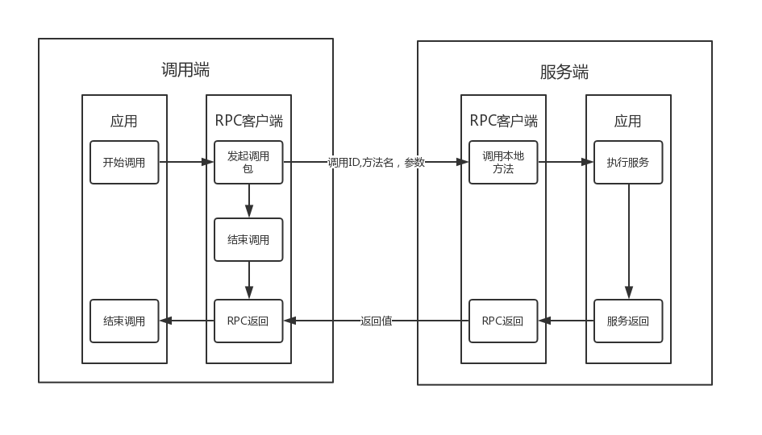

## PRC 简介

[什么是PRC](#什么是PRC)

[RPC详细请求流程](RPC详细请求流程)

## 什么是PRC

PRC(Rmote Procddure Call) 是一种通过网络从远程计算机程序上请求服务来得到计算服务或者数据服务，且不需要了解底层网络技术的协议和框架。对开发者而言，这种远程过程调用和普通本地调用没有什么区别，不过它们的底层实现是不同的；在OSI参考模型中RPC在传输层和应用层之间。

PRC 有以下优势:

1. 简单 。RPC语义十分简单和清晰，便于建立分布式系统。
2. 高效 。能高效地实现远程的过程调用。
3. 通用 。RPC导出的服务可以供多个使用者用于不同的目的。

> 与普通的http请求相比，客户端在发送请求时，不需要再额外参数配置，再去解析状态和返回值，不仅复杂而且容易出错。服务器在接收请求时，也不需要手动解析参数值，以及封装返回结果给客户端。

RPC请求流程简述：

1. 客户机调用进程发送一个有输入参数的调用信息给服务端进程，等待应答信息；
2. 服务端的进程保持睡眠状态直到调用信息到达，当调用信息到达时，服务端获取输入参数，计算结果或者进行一系列复杂操作，甚至调用其他服务器；
3. 服务器发送应答信息，并等待下一个调用信息；
4. 客户端调用进程接收到答复信息，获得输出的结果，再继续执行后续的操作。

## RPC详细请求流程

- 第一步，客户端调用本地的客户端存根方法（client stub）。客户端存根方法会将参数打包并封装成一个或多个网络消息体并发送到服务端。将参数封装到网络消息中的过程叫做编码(encode) ， 它会将所有数据序列化为字节数组格式。
- 第二步，客户端存根(client stub) 通过系统调用，使用操作系统内核提供的socket套接字接口来向远程服务发送我们编码的网络消息。
- 第三步，网络消息由内核通过某种协议(UDP/TCP) 传输到远程服务端。
- 第四步，服务端存根(server stub)接收到客户端发送的消息，并对参数进行解码(decode) ，通常它会将参数从标准的网络格式转换成特定语言格式。
- 第五步，服务单存根调用服务端的方法，并且将从客户端接收到的参数传递给该方法，运行具体功能并返回，这部分代码的执行对客户端来说就是远程过程调用。
- 第六步，服务端的方法在执行完成之后，会把结果返回到服务单存根代码中。
- 第七步，服务端存根在将该返回值进行编码并序列化之后，通过一个或多个网络消息发送给客户端。
- 第八步，消息通过网络发送到客户端存根中。
- 第九步，客户端存根从本地Socket接口中读取结果消息。
- 第十步，客户端存根再将结果返回给客户端函数，并且将消息从网络二进制形式转换为本地语言格式，这样就完成了远程服务调用，客户端代码继续执行后续的操作。

