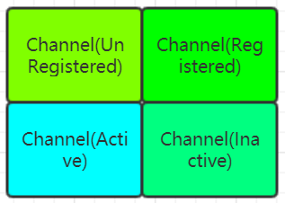
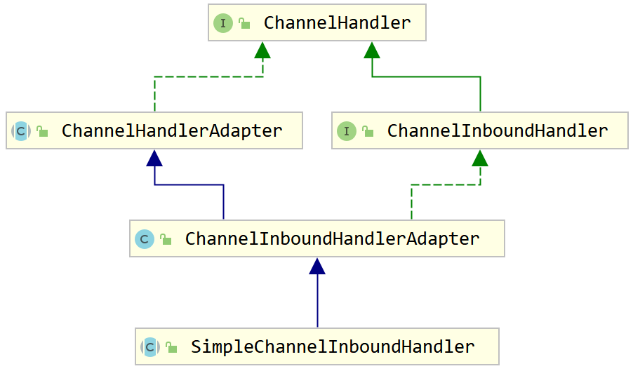

# Netty  ChannelHandler
## Channel
### Channel 生命周期


| 状态                | 描述                                                 |
| :------------------ | :--------------------------------------------------- |
| ChannelUnRegistered | 新创建的Channel，还未被注册到EventLoop中                |
| ChannelRegistered   | Channel已经被注册到EventLoop中                        |
| ChannelInActive     | Channel没有连接到远程节点                              |
| ChannelActive       | Channel处于活动状态(已经连接到远程节点),可接收/发送数据了 |
> 当这些状态发生改变时，将会生成对应的事件，这些事件会被转发给ChannelPipeline中的ChannelHandler，由ChannelHandler对它们做出响应。

## ChannelHandler 

### ChannelHandler 生命周期
| 类型            | 描述                                  |
| :-------------- | :----------------------------------- |
| handlerAdd      | 当handler被添加到pipeline时被调用      |
| handlerRemove   | 当handler被移除时被调用                |
| exceptionCaught | 处理过程中在pipeline中有错误发生时被调用 |
```java
public interface ChannelHandler {
    /**
     * Gets called after the {@link ChannelHandler} was added to the actual context and it's ready to handle events.
     */
    void handlerAdded(ChannelHandlerContext ctx) throws Exception;
    /**
     * Gets called after the {@link ChannelHandler} was removed from the actual context and it doesn't handle events
     * anymore.
     */
    void handlerRemoved(ChannelHandlerContext ctx) throws Exception;
    /**
     * Gets called if a {@link Throwable} was thrown.
     *
     * @deprecated is part of {@link ChannelInboundHandler}
     */
    @Deprecated
    void exceptionCaught(ChannelHandlerContext ctx, Throwable cause) throws Exception;
}
```

### ChannelInboundHandler接口
`ChannelInboundHandler`处理入站数据以及各种状态变化，它内部提供了ChannelInboundHandler的生命周期方法，这些方法将会在数据被接收或者与其对应的Channel状态发生改变时被调用。

`ChannelInboundHandler`的实现类如果重写了`channelRead`方法，则需要手动释放与池化的ByteBuf实例相关的内存。但是可以直接选择使用`SimpleChannelInboundHandler`类, 因为该类会自动释放资源。
```java
io.netty.channel.SimpleChannelInboundHandler#channelRead
@Override
public void channelRead(ChannelHandlerContext ctx, Object msg) throws Exception {
    boolean release = true;
    try {
        if (acceptInboundMessage(msg)) {
            @SuppressWarnings("unchecked")
            I imsg = (I) msg;
            channelRead0(ctx, imsg);
        } else {
            release = false;
            ctx.fireChannelRead(msg);
        }
    } finally {
        if (autoRelease && release) {
            ReferenceCountUtil.release(msg);
        }
    }
}
```
### ChannelOutboundHandler接口
`ChannelOutboundHandler`处理出站数据并且拦截所有的操作。

| 方法       | 描述(被调用的场景)                        |
| :--------- | :--------------------------------------- |
| bind       | 当请求将Channel绑定到本地地址时            |
| connect    | 当请求将Channel连接到远程节点时            |
| disconnect | 当请求将Channel从远程节点断开时            |
| close      | 当请求关闭Channel时                       |
| deregister | 当请求将Channel从它的EventLoop注销时       |
| read       | 当请求从Channel读取更多的数据时            |
| flush      | 当请求通过Channel将入队数据冲刷到远程节点时 |
| write      | 当请求通过Channel将数据写到远程节点时       |


### 适配器 - ChannelIn/OutboundHandlerAdapter

在`ChannelInboundHandlerAdapter`和`ChannelOutboundHandlerAdapter`中提供的方法调用了相关的`ChannelHandlerContext`上的等效方法，从而将事件转发到`ChannelPipeline`中的下一个`ChannelHandler`中。

## ChannelPipeline 接口
ChannelPipeline 是一个拦截流经Channel的入站和出站事件的Channelhandler实例链。每一个新创建的Channel都将会被永久分配一个新的ChannelPipeline。

如果一个入站事件被触发，它将被从`ChannelPipeline`的头部开始一直被传播到`Pipeline`的尾端，如上图所示，一个出站的I/O事件将从`ChannelPipeline`的最右边开始，然后向左传播。
当我们通过上图将入站/出站处理器混合添加到`Pipeline`中，那么第一个被入站事件看到的`ChannelHandler`是第一个处理器，而第一个被出站事件看到的是第五个处理器(按照从左到右编排)。

### 修改pipeline

| 名称                                | 描述                              |
| :---------------------------------- | :-------------------------------- |
| addFirst/addBefore/addAfter/addLast | 向ChannelPipeline添加handler       |
| remove                              | 从ChannelPipeline中移除Handler     |
| replace                             | 替换ChannelPipeline中的某个handler |
```java
ChannelPipeline channelPipeline = null;
channelPipeline.addLast("handler2",new ChannelInboundHandlerAdapter());
channelPipeline.addFirst("handler1",new ChannelInboundHandlerAdapter());
channelPipeline.remove("handler2");
channelPipeline.replace("handler1", "handler3", new ChannelInboundHandlerAdapter());

// 获取某个Handler
ChannelHandler handler3 = channelPipeline.get("handler3");
// 获取ChannelHandlerContext
ChannelHandlerContext context = channelPipeline.context("handler3");
// 获取channelPipeline中所有channelHandler的名字
List<String> channelNames= channelPipeline.names();
```

### 入站操作
| 方法                          | 描述                                                                          |
| :---------------------------- | :---------------------------------------------------------------------------- |
| fireChannelRegistered         | 调用ChannelPipeline中下一个ChanneInboundHandler的channelRegistered方法         |
| fireChannelUnRegistered       | 调用ChannelPipeline中下一个ChanneInboundHandler的channelUnRegistered方法       |
| fireChannelActive             | 调用ChannelPipeline中下一个ChanneInboundHandler的channelActive方法             |
| fireChannelInactive           | 调用ChannelPipeline中下一个ChanneInboundHandler的channelInactive方法           |
| fireExceptionCaught           | 调用ChannelPipeline中下一个ChanneInboundHandler的exceptionCaught方法           |
| fireUserEventTriggered        | 调用ChannelPipeline中下一个ChanneInboundHandler的userEventTriggered方法        |
| fireChannelRead               | 调用ChannelPipeline中下一个ChanneInboundHandler的channelRead方法               |
| fireChannelReadComplete       | 调用ChannelPipeline中下一个ChanneInboundHandler的channelReadCompete方法        |
| fireChannelWritabilityChanged | 调用ChannelPipeline中下一个ChanneInboundHandler的channelWritabilityChanged方法 |

### 出站操作
| 方法          | 描述                                                                         |
| :------------ | :--------------------------------------------------------------------------- |
| bind          | 将Channel绑定到一个本地地址，将调用pipeline的下一个outBoundHandler的bind方法    |
| connect       | 将channel连接到一个远程地址，将调用pipeline的下一个outBoundHandler的connect方法 |
| disconnect    | 将Chnanel断开连接，将调用pipeline的下一个outBoundHandler的disconnect方法       |
| close         | 将Chnanel关闭，将调用pipeline的下一个outBoundHandler的close方法                |
| deregister    | 将Channel从它先前所分配的EventExecutor(EventLoop)中注销，将调用....            |
| flush         | 冲刷Channel所有挂起的写入，将....                                             |
| write         | 将消息写入Channel，将...                                                      |
| writeAndFlush | 这是一个先调用write()方法再接着调用flush方法的便利方法                          |
| read          | 请求从Channel中读取更多数据，将...                                             |
```java
@Override
public void channelRead(ChannelHandlerContext ctx, Object msg) throws Exception {
    ByteBuf in = (ByteBuf)msg;
    System.out.println("server received:" + in.toString(CharsetUtil.UTF_8));
    // 调用pipeline中下一个outboundHandler处理
    ctx.pipeline().writeAndFlush(in);
}

@Override
public void channelReadComplete(ChannelHandlerContext ctx) throws Exception {
    ByteBuf byteBuf = Unpooled.copiedBuffer("数据都读取完成...", CharsetUtil.UTF_8);
    // 调用pipeline中下一个outboundHandler处理
    ctx.pipeline().writeAndFlush(byteBuf).addListener(ChannelFutureListener.CLOSE);
}
```

## ChannelHandlerContext

`ChannelHandlerContext`代表了`ChannelHnadler`和`ChannelPipeline`之间的关联，每当有`ChannelHandler`添加到`ChannelPipeline`中，都会创建`ChnanelHandlerContext`。
`ChannelHandlerContext`的主要功能是管理它所关联的`ChannelHandler`和在同一个`ChannelPipeline`中的其他`ChannelHandler`之间的交互。

### ChannelHandlerContext API
| 方法              | 描述                                                                                                                                                       |
| :---------------- | :--------------------------------------------------------------------------------------------------------------------------------------------------------- |
| alloc             | 返回和这个实例相关联的`Channel`所配置的`ByteBufAlloctor`                                                                                                     |
| bind              | 绑定到给定的`SocketAddress`, 并返回`ChannelFuture`                                                                                                          |
| chnanel           | 返回绑定到这个实例的Channel                                                                                                                                 |
| connect           | 连接给定的SocketAddress, 并返回ChannelFuture                                                                                                                |
| deregister        | 从之前分配的`EventExecutor`注销，并返回`ChannelFuture`                                                                                                       |
| disconnect        | 从远程节点断开，并返回`ChannelFuture`                                                                                                                        |
| executor          | 返回调度事件的`EventExector`                                                                                                                                |
| fireChannelActive | 触发对下一个`ChannelInboundHandler`上的`channelActive`方法                                                                                                  |
| firexxx           | 调用下一个`ChannelInboundHandler`xxx                                                                                                                        |
| handler           | 返回绑定到这个实例的`ChannelHandler`                                                                                                                        |
| isRemoved         | 如果所关联的`ChannelHandler`已经从`ChannelPipeline`中移除则返回true                                                                                          |
| name              | 返回这个实例的唯一名称                                                                                                                                       |
| pipeline          | 返回这个实例所关联的`ChannelPipeline`                                                                                                                       |
| read              | 将数据从`Channel`读取到第一个入站缓冲区；如果读取成功则触发一个`channelRead`事件，并在最有一个消息被读取完成后，通知ChannelInboundHandler的channelReadComplete方法 |
| write             | 通过这个实例写入消息并经过ChannelPipeline                                                                                                                    |
| writeAndFlush     | 通过这个实例写入并冲刷消息并经过ChannelPipeline                                                                                                              |

> ChannelHandlerContext有很多方法， 其中有一些方法也存在于Channel和ChannelPipeline本身上，但是如果调用Channel或者ChannelPipeline上的这些方法，他们将沿着整个ChnnelPipeline进行传播。**而调用位于ChannelHandlerContext上的相同方法，则将从当前所关联的ChannelHandler开始，并且只会传播给位于ChannelPipeline中的下一个能够处理该事件的ChannelHandler**。

### 基本用法


直接通过调用Channel或者ChannelPipeline的write方法，将一直传播事件通过整个ChannelPipeline，但是在ChannelHandler级别上，事件从一个ChannelHandler到下一个ChannelHandler的移动是由ChannelHandlerContext上的调用完成。
```java
@Override
public void channelRead(ChannelHandlerContext ctx, Object msg) throws Exception {
    ByteBuf in = (ByteBuf)msg;
    // 调用下一个inboundHandler处理
    System.out.println("第一个inBoundhandler获得处理");
    ctx.fireChannelRead(msg);
}

@Override
public void channelReadComplete(ChannelHandlerContext ctx) throws Exception {
    // 调用下一个inboundHandler处理
    ctx.fireChannelReadComplete();
}
```
### 高级用法
1. 可以通过`ChannelHandlerContext`获取`ChannelPipeline`，然后通过`ChannelPipeline`的`add`或者`remove`方法实现`ChannelHandler`的动态添加或者删除。
2. 将一个不标注`@Sharable`注解的`ChannelHandler`添加到多个`ChannelPipeline`时将会触发异常。所以在需要共享`ChannelHandler`上面必须添加`@Sharable`注解。
> 因为`ChannelHandler`本身有可能会被多个线程共享-当它被添加到多个`ChannelPipeline`中，将有可能被多个线程同时调用，产生线程安全问题，所以，在保证当前`ChannelHandler`是线程安全的情况下，才使用`@Sharable`注解。
以下代码示例是非线程安全的
```java
@ChannelHandler.Sharable
public class EchoServerMessageHandler extends ChannelInboundHandlerAdapter {
    int count = 0;
    @Override
    public void channelRead(ChannelHandlerContext ctx, Object msg) throws Exception {
        count ++;
    }
}
```
> 在多个`ChannelPipeline`中安装同一个`ChannelHandler`的一个常见的原因是用于收集跨越多个`Channel`的统计信息。

## 异常处理

### 处理入站异常
如果在某个`InboundChannelHandler`的处理中抛出异常，那么异常将会从该Handler开始一直往后传播，流经`ChannelPipeline`, 要想处理异常，需要重写`exceptionCaught`方法。
默认的`exceptionCaught`方法实现为 ：**将异常转发给`ChannelPipeline`的下一个`ChannelHandler`。**
```java
@Override
public void exceptionCaught(ChannelHandlerContext ctx, Throwable cause) throws Exception {
    // 往后传播
    ctx.fireExceptionCaught(cause);
}
```
所以，如果我们想要处理异常，就需要重写`exceptionCaught`方法:
```java
@Override
public void exceptionCaught(ChannelHandlerContext ctx, Throwable cause) throws Exception {
    // 打印异常栈
    cause.printStackTrace();
    // 关闭Channel
    ctx.close();
}
```
> 1. 无论异常会发生在`ChannelPipeline`中的哪个地方，想要始终能够得到处理，那么实现以上逻辑的代码通常位于`ChannelPipeline`的最后。
> 2. 如果异常达到了`ChannelPipeline`的尾端，他将会被记录为**未被处理**。

### 处理出站异常
用于处理出站操作中的正常完成以及异常的选项，都基于以下通知机制：
1. 每个出站操作都将返回一个`ChannelFuture`, 注册到`ChannelFuture`的`ChannelFutureListener`将在操作完成时被通知该操作是成功还是失败了。
```java
public void channelRead(ChannelHandlerContext ctx, Object msg) throws Exception {
    ByteBuf in = (ByteBuf)msg;
    System.out.println("server received:" + in.toString(CharsetUtil.UTF_8));
    ChannelFuture channelFuture = ctx.writeAndFlush(in);
    channelFuture.addListener(new ChannelFutureListener() {
        @Override
        public void operationComplete(ChannelFuture future) throws Exception {
            if(future.isSuccess()){
                System.out.println("写出成功!");
            }else{
                future.cause().printStackTrace();
                future.channel().close();
            }

        }
    });
}
```
2. 几乎所有的`ChannelOutboundHandler`上的方法都会传入一个`ChannelPromise`的实例，`ChannelPromise`可以被分配用于异步通知的监听器。
```java
@ChannelHandler.Sharable
public class EchoServerMessageOutboundHandler extends ChannelOutboundHandlerAdapter {
    @Override
    public void write(ChannelHandlerContext ctx, Object msg, ChannelPromise promise) throws Exception {
        ByteBuf in = (ByteBuf) msg;
        System.out.println("将要写出的数据是:" + in.toString(CharsetUtil.UTF_8));
        promise.addListener(new ChannelFutureListener() {
            @Override
            public void operationComplete(ChannelFuture future) throws Exception {
                if (future.isSuccess()) {
                    System.out.println("回调-写出成功");
                } else {
                    future.cause().printStackTrace();
                    future.channel().close();
                }
            }
        });
        super.write(ctx, msg, promise);
    }
}
```
通过调用`ChannelPromise`上的`setSuccess()`和`setFailure()`方法，**可以使一个操作的状态在`ChannelHandler`的方法返回给其他调用者时便即刻被感知到**。
因为`DefaultPromise`的`setSuccess()`实现如下：
```java
@Override
public Promise<V> setSuccess(V result) {
    if (setSuccess0(result)) {
        // 通知监听器
        notifyListeners();
        return this;
    }
    throw new IllegalStateException("complete already: " + this);
}
```
