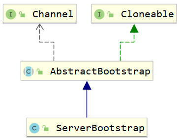

# Reactor线程模型之双线程池职责递交
## 代码示例
```java
public void start() throws InterruptedException {
    ServerBootstrap serverBootstrap = new ServerBootstrap();
    NioEventLoopGroup acceptGroup = new NioEventLoopGroup();
    NioEventLoopGroup channelGroup = new NioEventLoopGroup();
    serverBootstrap.group(acceptGroup, channelGroup)
            .channel(NioServerSocketChannel.class)
            .localAddress(new InetSocketAddress(port))
            .childHandler(new SimpleChannelInboundHandler<ByteBuf>() {
                @Override
                protected void channelRead0(ChannelHandlerContext ctx, ByteBuf msg) throws Exception {
                    System.out.println("Received Msg!");
                }
            });
    ChannelFuture channelFuture = serverBootstrap.bind().sync();
    channelFuture.channel().closeFuture().sync();
}
```

## Acceptor线程池接手
acceptor线程池的设置在`serverBootstrap.group(acceptGroup, channelGroup)`中，这段代码主要设置了两个线程池；
```java
public ServerBootstrap group(EventLoopGroup parentGroup, EventLoopGroup childGroup) {
    super.group(parentGroup);
    if (childGroup == null) {
        throw new NullPointerException("childGroup");
    }
    if (this.childGroup != null) {
        throw new IllegalStateException("childGroup set already");
    }
    this.childGroup = childGroup;
    return this;
}
```
ServerBootstrap继承自AbstractBootstrap, childGroup设置在ServerBootstrap中，而parentGroup(即accetpGroup)设置在其父类-AbstractBootstrap中。


我们看之前`channel`的`init`方法
```java
@Override
void init(Channel channel) throws Exception {
    final Map<ChannelOption<?>, Object> options = options0();
    synchronized (options) {
        setChannelOptions(channel, options, logger);
    }

    final Map<AttributeKey<?>, Object> attrs = attrs0();
    synchronized (attrs) {
        for (Entry<AttributeKey<?>, Object> e: attrs.entrySet()) {
            @SuppressWarnings("unchecked")
            AttributeKey<Object> key = (AttributeKey<Object>) e.getKey();
            channel.attr(key).set(e.getValue());
        }
    }

    ChannelPipeline p = channel.pipeline();

    // 取出childGroup
    final EventLoopGroup currentChildGroup = childGroup;
    final ChannelHandler currentChildHandler = childHandler;
    final Entry<ChannelOption<?>, Object>[] currentChildOptions;
    final Entry<AttributeKey<?>, Object>[] currentChildAttrs;
    synchronized (childOptions) {
        currentChildOptions = childOptions.entrySet().toArray(newOptionArray(childOptions.size()));
    }
    synchronized (childAttrs) {
        currentChildAttrs = childAttrs.entrySet().toArray(newAttrArray(childAttrs.size()));
    }
    // pipeline后追加新的handler
    p.addLast(new ChannelInitializer<Channel>() {
        @Override
        public void initChannel(final Channel ch) throws Exception {
            final ChannelPipeline pipeline = ch.pipeline();
            ChannelHandler handler = config.handler();
            if (handler != null) {
                pipeline.addLast(handler);
            }

            ch.eventLoop().execute(new Runnable() {
                @Override
                public void run() {
                    pipeline.addLast(new ServerBootstrapAcceptor(
                            ch, currentChildGroup, currentChildHandler, currentChildOptions, currentChildAttrs));
                }
            });
        }
    });
}
```
我们可以看见这个取出来的`currentChildHandler`被当成构造方法放入到`ServerBoostrapAcceptor`(ChannelHandler)中, 我们先看下这个`ChannelHandler`的内部实现:
```java
private static class ServerBootstrapAcceptor extends ChannelInboundHandlerAdapter {

    private final EventLoopGroup childGroup;
    private final ChannelHandler childHandler;
    private final Entry<ChannelOption<?>, Object>[] childOptions;
    private final Entry<AttributeKey<?>, Object>[] childAttrs;
    private final Runnable enableAutoReadTask;

    ServerBootstrapAcceptor(
            final Channel channel, EventLoopGroup childGroup, ChannelHandler childHandler,
            Entry<ChannelOption<?>, Object>[] childOptions, Entry<AttributeKey<?>, Object>[] childAttrs) {
        // 初始化childGroup
        this.childGroup = childGroup;
        // 这个handler其实是我们自定义的ChannelHandler
        this.childHandler = childHandler;
        this.childOptions = childOptions;
        this.childAttrs = childAttrs;

        // Task which is scheduled to re-enable auto-read.
        // It's important to create this Runnable before we try to submit it as otherwise the URLClassLoader may
        // not be able to load the class because of the file limit it already reached.
        //
        // See https://github.com/netty/netty/issues/1328
        enableAutoReadTask = new Runnable() {
            @Override
            public void run() {
                channel.config().setAutoRead(true);
            }
        };
    }

    @Override
    @SuppressWarnings("unchecked")
    // 当读取到数据时，该方法被回调
    public void channelRead(ChannelHandlerContext ctx, Object msg) {
        final Channel child = (Channel) msg;
        // 将我们自定义的ChnanelHandler添加到pipeline中
        child.pipeline().addLast(childHandler);
        // 设置其他属性
        setChannelOptions(child, childOptions, logger);
        for (Entry<AttributeKey<?>, Object> e: childAttrs) {
            child.attr((AttributeKey<Object>) e.getKey()).set(e.getValue());
        }

        try {
            // 将当前Channel注册到子EventLoopGroup中。
            childGroup.register(child).addListener(new ChannelFutureListener() {
                @Override
                public void operationComplete(ChannelFuture future) throws Exception {
                    if (!future.isSuccess()) {
                        forceClose(child, future.cause());
                    }
                }
            });
        } catch (Throwable t) {
            forceClose(child, t);
        }
    }

    private static void forceClose(Channel child, Throwable t) {
        ...
    }

    @Override
    public void exceptionCaught(ChannelHandlerContext ctx, Throwable cause) throws Exception {
        ...
    }
}
```
我们首先猜测下什么时候会调用handler里面的initChannel方法
```java
/**
 * This method will be called once the {@link Channel} was registered. After the method returns this instance
 * will be removed from the {@link ChannelPipeline} of the {@link Channel}.
 *
 * @param ch            the {@link Channel} which was registered.
 * @throws Exception    is thrown if an error occurs. In that case it will be handled by
 *                      {@link #exceptionCaught(ChannelHandlerContext, Throwable)} which will by default close
 *                      the {@link Channel}.
 */
protected abstract void initChannel(C ch) throws Exception;
```
根据注释，我们看到，当`Channel`注册成功之后，会回调`ChannelHandler`的`initChannel`方法，`Channel`注册成功是什么时候呢？
是在`Channenl`的`init`方法之后：
```java
Channel channel = null;
try {
    channel = channelFactory.newChannel();
    // 初始化Channel, 在据上所述，在pipeline 中增加新的handler，这个handler就是递交任务的中间产品
    init(channel);
} catch (Throwable t) {
    if (channel != null) {
        // channel can be null if newChannel crashed (eg SocketException("too many open files"))
        channel.unsafe().closeForcibly();
        // as the Channel is not registered yet we need to force the usage of the GlobalEventExecutor
        return new DefaultChannelPromise(channel, GlobalEventExecutor.INSTANCE).setFailure(t);
    }
    // as the Channel is not registered yet we need to force the usage of the GlobalEventExecutor
    return new DefaultChannelPromise(new FailedChannel(), GlobalEventExecutor.INSTANCE).setFailure(t);
}
// 正式在parentGroup中注册channel
ChannelFuture regFuture = config().group().register(channel);
if (regFuture.cause() != null) {
    if (channel.isRegistered()) {
        channel.close();
    } else {
        channel.unsafe().closeForcibly();
    }
}
```
我们之前说过，在`channel`注册成功之后，会回调`pipeline`中的`channelHandler`中的`initChannel`方法，而这个`initChannel`方法内部在pipeline中注册了新的Handler-ServerBootstrapAcceptor
```java
ch.eventLoop().execute(new Runnable() {
    @Override
    public void run() {
        pipeline.addLast(new ServerBootstrapAcceptor(
                ch, currentChildGroup, currentChildHandler, currentChildOptions, currentChildAttrs));
    }
});
```
而这个`ServerBootstrapAcceptor`主要方法是`channelRead`方法：
```java
public void channelRead(ChannelHandlerContext ctx, Object msg) {
    final Channel child = (Channel) msg;
    // 将我们自定义的ChnanelHandler添加到pipeline中
    child.pipeline().addLast(childHandler);
    // 设置其他属性
    setChannelOptions(child, childOptions, logger);
    for (Entry<AttributeKey<?>, Object> e: childAttrs) {
        child.attr((AttributeKey<Object>) e.getKey()).set(e.getValue());
    }

    try {
        // 将当前Channel注册到子EventLoopGroup中。
        childGroup.register(child).addListener(new ChannelFutureListener() {
            @Override
            public void operationComplete(ChannelFuture future) throws Exception {
                if (!future.isSuccess()) {
                    forceClose(child, future.cause());
                }
            }
        });
    } catch (Throwable t) {
        forceClose(child, t);
    }
}
```
我们知道`ChannelRead`是当读取到数据数据时被调用， 也就是当`Acceptor`线程组发现有可读数据要读取时，会回调`ChannelHandler`中的`channelRead`方法，我们再看这个方法，内部有将这个`child`也就是`channel`注册到`childGroup`中，也就是-生产处理`Channel`读/写数据事件的EventLoop的线程组-`EventLoopGroup`, 当这个`channel`被注册到对应`EventLoopGroup`下的`EventLoop`上，就可以正常监听其他事件了。
到此为止，该`Channel`中的其他事件就由第二个`EventLoopGroup`中的`EventLoop`来监听处理了。


## 验证
### 两个`Group`初始化
首先我们想要知道当前`Eventloop`所属的`EventLoopGroup`, 则要知道当前的Group标识，我们可以通过对象的ID来判别，首先我们回到`ServerBoostrap`示例代码中，看一下实例化的两个`group`分别是谁：
示例代码如下：
```java
public void start() throws InterruptedException {
    EchoServerMessageHandler echoServerMessageHandler = new EchoServerMessageHandler();
    NioEventLoopGroup bossGroup = new NioEventLoopGroup();
    NioEventLoopGroup workGroup = new NioEventLoopGroup();
    ServerBootstrap serverBootstrap = new ServerBootstrap();
    serverBootstrap.group(bossGroup,workGroup)
            .channel(NioServerSocketChannel.class)
            .localAddress(new InetSocketAddress(port))
            .childHandler(new ChannelInitializer<SocketChannel>() {
                protected void initChannel(SocketChannel socketChannel) {
                    socketChannel.pipeline()
                            .addLast(echoServerMessageHandler);
                }
            });
    try {
        ChannelFuture channelFuture = serverBootstrap.bind().sync();
        channelFuture.channel().closeFuture().sync();
    }catch (Exception e){
        e.printStackTrace();
    }finally {
        bossGroup.shutdownGracefully().sync();
        workGroup.shutdownGracefully().sync();
    }
}
```

根据断点，我们看到`bossGroup` = 1110, `workGroup` = 1111;

### 具体执行逻辑
我们都知道接收请求的入口为`NioEventLoop#run()`， 我们在如下(`NioEventLoop#processSelectedKey`)地方打断点：
```java
private void processSelectedKey(SelectionKey k, AbstractNioChannel ch) {
    try {
        ...
        // Also check for readOps of 0 to workaround possible JDK bug which may otherwise lead
        // to a spin loop
        if ((readyOps & (SelectionKey.OP_READ | SelectionKey.OP_ACCEPT)) != 0 || readyOps == 0) {
            // 断点处
            unsafe.read();
        }
    } catch (CancelledKeyException ignored) {
        unsafe.close(unsafe.voidPromise());
    }
}
```
我们启动客户端，Server监听到客户端的连接，断点就走到这个地方


到此处，我们看下目前`EventLoop`的`group`来源，以及`channel`的`pipeline`中的`ChannelHandler`：
#### group
我们知道`EventLoop`有一个`parent()`方法，这个方法返回了`EventLoopGroup`的引用，我们调用这个方法：

我们发现，这个`group` = 1110 = `bossGroup`
#### pipeline
我们继续从上面的断点处`unsafe.read();`走进去-`io.netty.channel.nio.AbstractNioMessageChannel.NioMessageUnsafe#read`

我们发现，其实`pipeline`内部的`ChannelHandler`链如下：
HeadContext ---> ServerBootstrapAcceptor ---> TailContext

#### HeadContext(划水)
我们接着往下执行代码：
```java
int size = readBuf.size();
for (int i = 0; i < size; i ++) {
    readPending = false;
    pipeline.fireChannelRead(readBuf.get(i));
}
```
这里主要是传播`ChannelRead`事件，这个事件我们非常熟悉，因为`ServerBootstrapAcceptor`这个`Handler`内部的实现，它内部实现了`channelRead`事件; 我们先看代码往下执行：按照预期，其会先走`HeadContext ---> ServerBootstrapAcceptor ---> TailContext`这个流程：
首先进入了`DefaultChannelPipeline`中：
```java
@Override
public final ChannelPipeline fireChannelRead(Object msg) {
    // head = HeadContext
    AbstractChannelHandlerContext.invokeChannelRead(head, msg);
    return this;
}
```
继续走下去，其实就是要调用`headContext`对应的`channelRead`方法：
```java
static void invokeChannelRead(final AbstractChannelHandlerContext next, Object msg) {
    final Object m = next.pipeline.touch(ObjectUtil.checkNotNull(msg, "msg"), next);
    EventExecutor executor = next.executor();
    if (executor.inEventLoop()) {
        // 调用HeadContext的ChannelRead方法
        next.invokeChannelRead(m);
    } else {
        executor.execute(new Runnable() {
            @Override
            public void run() {
                next.invokeChannelRead(m);
            }
        });
    }
}
```
我们跳过中间的执行，直接跳到`HeadContext`的`channelRead`方法：
```java
@Override
public void channelRead(ChannelHandlerContext ctx, Object msg) throws Exception {
    ctx.fireChannelRead(msg);
}
```
我们看到，这是一个划水`Handler`, 直接调用了`ChnanelHandlerContext`的下一个`ChannelHandler`:

#### 大权移交
终于，我们到达的预期的位置：
```java
@Override
@SuppressWarnings("unchecked")
public void channelRead(ChannelHandlerContext ctx, Object msg) {
    final Channel child = (Channel) msg;

    child.pipeline().addLast(childHandler);

    setChannelOptions(child, childOptions, logger);

    for (Entry<AttributeKey<?>, Object> e: childAttrs) {
        child.attr((AttributeKey<Object>) e.getKey()).set(e.getValue());
    }

    try {
        childGroup.register(child).addListener(new ChannelFutureListener() {
            @Override
            public void operationComplete(ChannelFuture future) throws Exception {
                if (!future.isSuccess()) {
                    forceClose(child, future.cause());
                }
            }
        });
    } catch (Throwable t) {
        forceClose(child, t);
    }
}
```
我们现在所在的位置，所在的线程-`EventLoop`,所在的`Group`, 依旧是`bossGroup`；
怎么验证呢？既然`eventLoop`是一个线程，我们就可以通过`Thread.currentThread`来看：

之前我们有看过`eventloop`的id, 发现1315，所以目前所在的Group = bossGroup;


我们继续走下去，分析下当前执行的这段代码：
```java
@Override
@SuppressWarnings("unchecked")
public void channelRead(ChannelHandlerContext ctx, Object msg) {
    final Channel child = (Channel) msg;
    // (1)添加Hander
    child.pipeline().addLast(childHandler);
    ...
    try {
        // (2)将当前channel注册到workerGroup中
        childGroup.register(child).addListener(...);
    } catch (Throwable t) {
        forceClose(child, t);
    }
}
```
在(1)位置，添加了handler（其实这个handler就是我们自定义的channelHandler）之后,:

我们发现pipeline中channelHandler为：
HeadContext ---> EchoServerHandler ---> TailContext
这个倒是很意料，因为ServerBoostractAcceptor消息了？
在(2)的位置，将当前`channel`注册在`childGroup`上，接下来的事件就由`childGroup`来处理。

#### 消息的迎客小二
我们再看`ServerBoostractAcceptor`这个ChannelHandler去哪儿了，我们先看下` child.pipeline().addLast(childHandler);`这段代码：打完断点之后，我们看下addLast之前，pipeline里面的构造：

我们发现在addLast执行之前，就已经没有acceptor了，这是为什么？

因为这两个的地方pipeline不是一个东西


