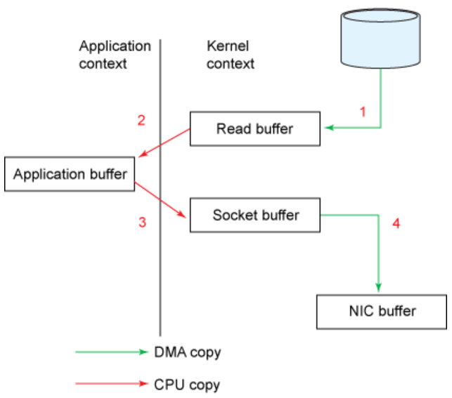
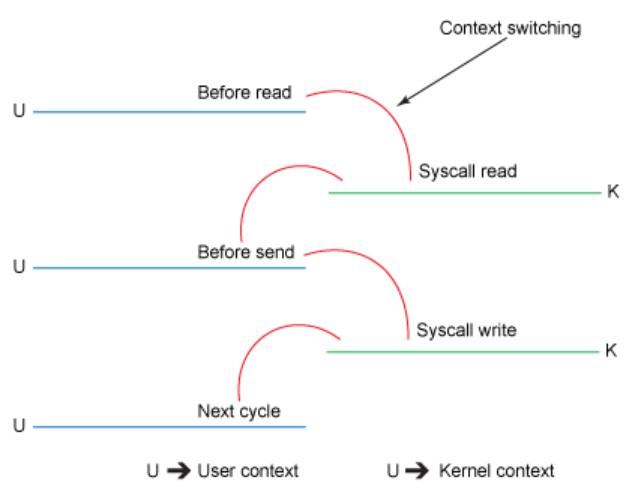
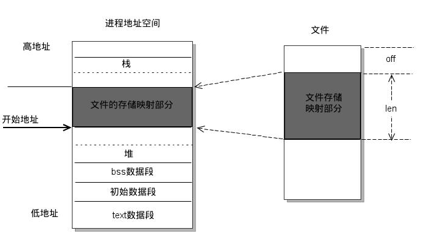

> To better understand the solution to a problem, we first need to understand the problem itself. 
## 关于0拷贝
### 正常情况下的数据拷贝
关于以下示例代码，操作系统内部完成了几次拷贝？
```c
File.read(fileDesc, buf, len);
Socket.send(socket, buf, len);
```


拷贝操作： 
1. 执行read指令，数据通过DMA从文件系统中拷贝到内核缓冲区(用户态->内核态)；
2. CPU将数据从内核缓冲区拷贝到用户缓冲区, read指令返回。(内核态->用户态)
3. 执行write指令，CPU将数据从用户态缓冲区拷贝到套接字对应的内核缓存区(和第1步以及第2步的内核缓冲区不同，这个缓冲区与套接字相关。 用户态->内核态)；
4. write指令返回，通过DMA将数据从内核缓冲区拷贝到NIC缓冲区(即网卡缓冲区)。(内核态->用户态);
> 数据拷贝到网卡缓冲区之后，并不一定是立即发送出去，而是将数据放入一个队列中，也许队列之前已经存在一些数据，所以遵循FIFO原则，也需要等到前面的数据包发送出去之后，才可以发送刚拷贝到网卡缓冲区中的数据。

上下文切换：


可以很明显发现，其实四次拷贝既浪费性能也浪费空间，那如何来优化这部分？

### mmap 取代read-优化
> mmap是一种内存映射文件的方法，即将一个文件或者其它对象映射到进程的地址空间，实现文件磁盘地址和进程虚拟地址空间中一段虚拟地址的一一对映关系。实现这样的映射关系后，进程就可以采用指针的方式读写操作这一段内存，而系统会自动回写脏页面到对应的文件磁盘上，即完成了对文件的操作而不必再调用read,write等系统调用函数。相反，内核空间对这段区域的修改也直接反映用户空间，从而可以实现不同进程间的文件共享。




之前的操作，可以替换成如下代码执行：
```c
tmp_buf = mmap(file, len);
write(socket, tmp_buf, len);
```

通过mmap技术优化，我们可以摆脱掉第二次拷贝，CPU不需要将数据再从内核态中拷贝到用户态，而是在用户态直接操作数据；虽然减少了一次拷贝，但是上下文切换仍然有4次；


步骤：
1. 执行mmap指令，通过DMA引擎将数据拷贝到内核缓冲区(该内核缓冲区与用户进程共享，即无需再从内核态往用户态拷贝)。
2. 执行write指令，将数据从内核缓冲区直接拷贝到另一块与套接字联系的缓冲区上；
3. 通过DMA引擎将数据从套接字缓冲区拷贝到网卡缓冲区上；

### sendFile 优化

```c
sendfile(socket, file, len);
```
Linux 2.1 版本 提供了 sendFile 函数，其基本原理如下：数据根本不经过用户态，直接从内核缓冲区进入到 Socket Buffer，同时，由于和用户态完全无关，就减少了一次上下文切换。


步骤：
1. 通过DMA引擎将文件数据拷贝到内核缓冲区中，紧接着将内核缓冲区中的数据拷贝到套接字缓冲区中。
2. 通过DMA引擎将套接字缓冲区中的数据拷贝到网卡缓冲区中。

通过sendFile方式的优化，就只需要做2次上下文切换。但是站在CPU的角度上，还剩下一次拷贝(DMA copy 并不需要CPU参与), 所以对于0拷贝的目标，应该还是有优化空间的。

### 最终优化（实现0拷贝）
Linux 在 2.4 版本即之后版本，** 数据不再从内核态拷贝到socket缓冲区**，而是从内核态直接拷贝到网卡缓冲区中，从而又减少了一次拷贝, 这样从CPU的角度上来考虑，就实现了0拷贝；


## 缓冲区
### 什么是缓冲区
缓冲区又称为缓存，它是内存空间的一部分。也就是说，在内存空间中预留了一定的存储空间，这些存储空间用来缓冲输入或输出的数据，这部分预留的空间就叫做缓冲区。缓冲区根据其对应的是输入设备还是输出设备，分为输入缓冲区和输出缓冲区。
### 为什么要引入缓冲区
比如我们从磁盘里取信息，我们先把读出的数据放在缓冲区，计算机再直接从缓冲区中取数据，等缓冲区的数据取完后再去磁盘中读取，这样就可以减少磁盘的读写次数，再加上计算机对缓冲区的操作大大快于对磁盘的操作，故应用缓冲区可大大提高计算机的运行速度。
又比如，我们使用打印机打印文档，由于打印机的打印速度相对较慢，我们先把文档输出到打印机相应的缓冲区，打印机再自行逐步打印，这时我们的CPU可以处理别的事情。缓冲区就是一块内存区，它用在输入输出设备和CPU之间，用来缓存数据。它使得低速的输入输出设备和高速的CPU能够协调工作，避免低速的输入输出设备占用CPU，解放出CPU，使其能够高效率工作。
### 缓冲区的刷新
下列情况会引发缓冲区的刷新:
1、缓冲区满时；
2、执行flush语句；
3、执行endl语句；
4、关闭文件。
可见，缓冲区满或关闭文件时都会刷新缓冲区，进行真正的I/O操作。另外，在C++中，我们可以使用flush函数来刷新缓冲区（执行I/O操作并清空缓冲区），如：cout << flush; //将显存的内容立即输出到显示器上进行显示

## 网络数据传输经历过多少buffer?


## JDK对零拷贝的支持
```java
java.nio.channels.FileChannel#transferTo
```
通过java的FileChannel.transferTo方法，可以避免上面两次多余的拷贝（当然这需要底层操作系统支持）
1. 调用transferTo,数据从文件由DMA引擎拷贝到内核read buffer
2. 接着DMA从内核read buffer将数据拷贝到网卡接口buffer
直接达到零拷贝的目的。

## 参考文档
1. https://www.linuxjournal.com/article/6345?page=0,0
2. https://developer.ibm.com/articles/j-zerocopy/
3. https://www.jianshu.com/p/a199ca28e80d
