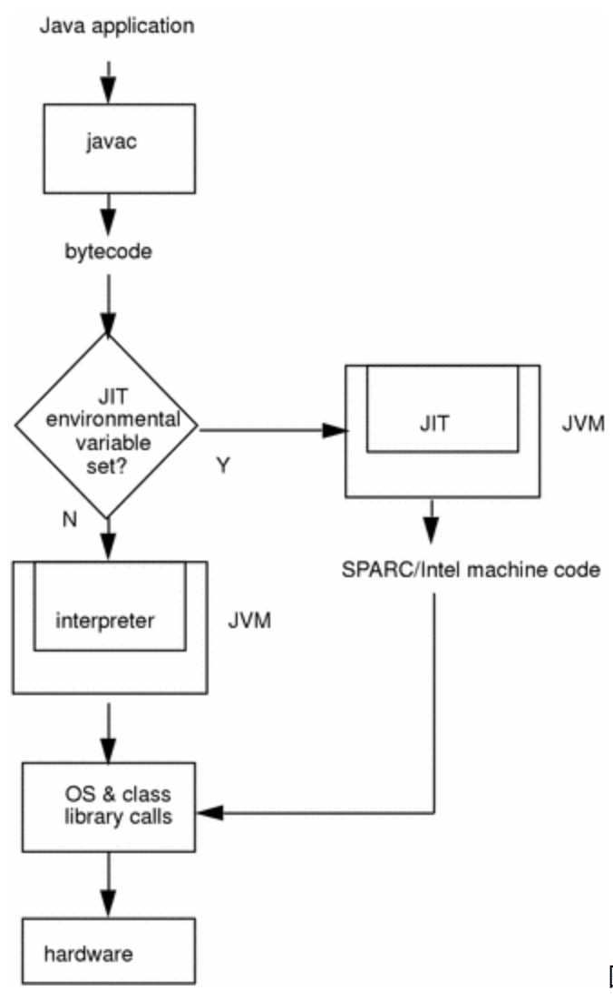

# 运行期优化技术-方法内联，公共子表达式消除，数组边界检查消除，逃逸分析等技术总结

## 目录概览

- 即时编译器与javac
- java执行模式-编译执行，解释执行，混合执行
- 常见优化技术
  - 方法内联
  - 公共子表达式消除
  - 数组边界检查消除
  - 逃逸分析


## 即时编译器与javac
>   Java compiler compiles source files (.java) to bytecode files (.class). Sun gives a free java compiler which is invoked with the ‘javac’ command.
>   A java interpreter is usually referred to as the Java Virtual Machine (or JVM). It reads and executes the bytecodes in the .class files.  Sun also supplies a free version of the JVM which is invoked with the ‘java’ command.
>   Where we get confusing is when people talk about a Just-In-Time compiler (or JIT compiler). This is actually part of a JVM. Its purpose is to take the generic (i.e. cross-platform) bytecodes and compile them into more machine-specific instructions (allowing the program to run significantly faster). Even though it is referred to as a JIT ‘compiler’, it is part of the Virtual Machine.
>   Now, this is what every JVM is facing: should it further translate those byte codes (using that JIT compiler) or should it interpret (or execute) these things itself? JIT compilation is just what it says: just in time compilation. Facing the choice of interpreting those byte codes itself (being slow) or compiling it into real machine code (by activating the JIT compiler) first and then let the real processor do the job, so the real machine code could get executed (or interpreted) by the real CPU is quite a choice to make.

javac : 将.java文件转换成.class文件；
JIT(即时编译器)：将.class文件编译为本地平台相关的机器码，并进行各个层次的优化；
> JIT是JVM可选的组件，可以不需要。并且JVM对JIT的实现并没有做任何限制。

## java执行模式-编译执行，解释执行，混合执行
> 首先我们编写好的Java代码会通过Javac编译成字节码文件（bytecode），在运行的时候，通过JVM内嵌的解释器将字节码文件解释成机器码。但是常见的JVM例如Hotspot虚拟机，都提供了JIN（just int time）机制,此机制被称为动态编译机制，它可以将反复执行的热点代码直接编译成机器码，这种情况下部分热点代码的执行就属于编译执行，而不是解释执行了。

### 编译执行：
  将代码编译成本地代码之后执行；
  Hotspot提供两个JIT,分别是Client Compiler 和Server Compiler,可以通过"-client"或"-server"参数强制指定虚拟机运行在Client模式或Server模式。
### 解释执行：
  省去编译操作,直接将字节码转换成机器码执行;
### 混合模式:
  混合模式表示解释器与编译器搭配使用的方式。
  "-Xint" ：强制虚拟机运行于"解释模式";
  "-Xcomp": 强制虚拟机运行于"编译模式";
### 混合模式执行流程：
  
  步骤说明:
  整个java应用程序的执行过程如下：
  1、源代码经javac编译成字节码，class文件
  2、程序字节码经过JIT环境变量进行判断，是否属于“热点代码”（多次调用的方法，或循环等）
  3、如是，走JIT编译为具体硬件处理器（如sparc、intel）机器码
  4、如否，则直接由解释器解释执行
  5、操作系统及类库调用
  6、硬件
## 常见优化技术
> 就是因为有JIT才有这些优化技术，字节码在被解释成机器码执行之前，会经过JIT进行优化。

### 公共子表达式消除
  如果一个表达式E已经计算过了，并且从先前的计算到现在E中所有变量的值都没有发生变化，那么E的这次出现就成为了公共子表达式，对于这种表达式，只需要直接用之前计算过的表达式结果代替就可以了，每必要再计算一遍。
  如下示例代码，未经过GIT优化之前
  ```java
  int d = (c * b) * 12 + a + (a + b * c);
  ```
  优化之后：
  ```java
  int d = E * 13 + a * 2;
  ```
### 数组边界检查消除
  正常情况下，我们在访问数组中的某个索引对应的数据时，系统会自动进行上下界的范围检查，即检查i必须满足i>=0 && i <array.length，否则将抛出数组越界异常。但是这种检查，并不是任何情况都是需要的，编译期根据数据流来分析数组的长度，判断索引下标是否已经越界，如果没有越界的话，就可以把数组的上下界检查消除，可以节省很多次的条件判断条件。

### 方法内联
  方法内联要做的事就是消除方法调用。
  ```java
  public static void foo(Object obj){
      if(obj != null)
          System.out.println("do something");
  }
  public static void testInline(String[] args){
      Object obj = null; 
      foo(obj);
  }
  ```
  以上代码，事实上testInline()方法的内部全部都是无用的代码，如果不做内联，后续即使进行了无用代码消除的优化，也无法发现任何"Dead Code",因为分开看，foo()和testInline()两个方法里面的操作都可能是有意义的。
  **方法内联是如何做到的？**
  答：把目标方法的代码copy到发起调用的方法中，避免发生真是的方法调用而已。
### 逃逸分析
  逃逸分析并不是直接优化代码的手段，而是为其他优化手段提供依据的分析技术。
  方法逃逸：当一个对象在方法中被定义之后，他可能被外部方法所引用，例如作为调用参数传递给其他方法中。
  线程逃逸：以上描述逃逸出来的对象，甚至可能被其他线程访问，比如赋值给类变量；
  > -XX: +DoEscapeAnalysis 手动开启逃逸分析
  > -XX: +PrintEscapeAnalysis 查看分析结果
  
  假如一个对象不会逃逸到其他方法或者线程之外（通过以上逃逸分析之后证明），则可能为这个变量进行一些高效的优化。
  - 栈上分配：如果确定一个对象不会逃逸出方法之外，那让这个对象在栈上分配内存能够减小GC压力，对象占用的内存空间就可以随栈帧出栈而销毁。
  - 同步消除：如果逃逸分析能够确定一个变量不会逃逸出线程，无法被其他线程访问，那这个变量的读写肯定就不会有竞争，对这个变量实施的同步措施也就可以消除掉。
    > -XX: +EliminateLocks 开启同步消除
  - 标量替换：如果把一个对象拆散，根据程序访问的情况，将其使用的成员变量恢复原始类型来访问就叫做标量替换。
    > -XX: +EliminateAllocations 开启标量替换
    > -XX: +PrintEliminateAllocations 查看标量替换情况
    标量：一个数据已经无法再分解成更小的数据来表示了,java的原始类型数据都是标量。
    聚合量：如果一个数据可以继续分解，那它就是聚合量。
    
    拆散对象的好处是：
      - 让成员变量分配在栈上；
      - 为后续进一步优化创建条件；
   

