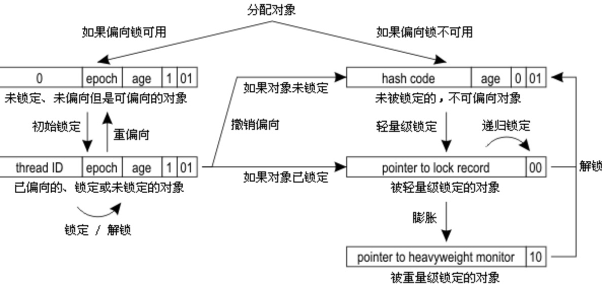

### 深入理解JVM-线程安全与锁优化

## 目录

- [线程安全](#线程安全)
	- [Java语言中的线程安全](#Java语言中的线程安全)
		- [不可变](#不可变)
		- [绝对线程安全](#绝对线程安全)
		- [相对线程安全](#相对线程安全)
		- [线程兼容](#线程兼容)
		- [线程对立](#线程对立)
	- [线程安全的实现方法](#线程安全的实现方法)
		- [互斥同步](#互斥同步)
		- [非阻塞同步](#非阻塞同步)
		- [无同步方案](#无同步方案)
- [锁优化](#锁优化)
	- [自旋锁](#自旋锁)
	- [自适应自旋锁](#自适应自旋锁)
	- [锁消除](#消除)
	- [锁粗化](#锁粗化)
	- [轻量级锁](#轻量级锁)
		- [对象头的内存布局](#对象头的内存布局)
	- [偏向锁](#偏向锁)


## 线程安全
> 当多个线程访问同一个对象时，如果不用考虑这些线程在运行时环境下的调度和交替执行，也不需要进行额外的同步，或者在调用方进行任何其他的协调操作，调用这个对象的行为都可以获得正确的结果，那这个对象就是线程安全的。

### Java语言中的线程安全

#### 1. 不可变
1. 基本数据类型使用final修饰
2. 引用对象，需要保证对象的行为不会对其状态产生任何影响。(String的所有方法都是返回新的对象)
> 保证对象的行为不会对其状态产生影响的方式有：1. 把对象中带有状态的变量都声明成final。2. 模仿String,返回新的对象；
> 
#### 2. 绝对线程安全
大多数线程安全的类并不是绝对线程安全的。例如Vector，虽然它的方法都是同步的，但是如果多个线程同时对其进行操作，一个线程迭代读，一个线程迭代删除元素，虽然能保证增加，删除元素等都是原子操作，但是很有可能出现一种情况A线程读到第10个，而线程B这个时候去删除第11个元素，那么早晚会因为索引问题（A线程还以为元素的个数不变）导致抛出数组越界异常。

#### 3. 相对线程安全
它需要保证对这个对象的单独的操作都是线程安全的，例如Vector,HashTable,Collections的synchronizedCollection()方法包装的集合等。

#### 4. 线程兼容
指对象本身并不是线程安全的，但是可以通过在调用端正确的使用同步手段来保证对象在并发环境中可以安全的使用，例如Vector, HashTable,ArrayList等

#### 5. 线程对立
指无论调用端是否采用同步措施，都无法在多线程环境中并发使用的代码。

### 线程安全的实现方法
#### 1. 互斥同步
加锁，使用Lock或者synchronized.
#### 2. 非阻塞同步
CAS
#### 3. 无同步方案
线程本地存储-ThreadLocal

## 锁优化
### 自旋锁
互斥同步对性能最大的影响是阻塞的实现，挂起线程和恢复线程的操作都需要转入的内核态中完成，这些操作给系统的并发性能带来了很大的影响。如果共享数据的锁定状态只会持续很短的一段时间，为了这段时间去挂起和恢复线程并不值得。
#### 概念
如果物理机器有一个以上的处理器，能让两个或两个以上线程同时并行执行，我们就可以让后面请求锁的线程“稍等一下”,但不放弃处理器的执行时间，看看持有锁的线程是否能很快就会释放锁。为了让线程等待，我们只需要让线程执行一个忙循环(自旋),这就是自旋锁。
> -XX:+UseSpinning 开启自旋锁
自旋等待本身虽然避免了线程切换的开销，但它是要占用处理器时间的，因此如果锁被占用的时间短，自旋等待的效果会非常好，反之，如果锁被占用的时间过长，那么自旋的线程只会白白消耗处理器资源，不会做任何有用的工作，反而会带来性能上的浪费。
> 自旋等待的时间必须要有一定的限度，默认自旋次数超过10次，就会使用传统的方式挂起线程。
> -XX:PreBlockSpin 修改自旋次数
#### 小结
使用自旋锁的两个条件：1. 线程执行任务的时间比较短，不会占用很长时间的锁；2. 物理机器有1个以上的处理器；
### 自适应自旋锁
#### 概念
自旋次数不再固定，而是由前一次在同一个锁上的自旋时间及锁的拥有者的状态决定。
> 1. 如果在同一个锁对象上，自旋等待刚刚成功获得锁，并且持有锁的线程正在运行中，那么虚拟机就会认为这次自旋也很有再次成功，进而他将允许自旋等待持续相对更长的时间，比如100个循环。
> 2. 如果对于某个锁，自旋很少成功过，那在以后要获取这个锁时，将可能省略掉自旋过程，以避免浪费处理器资源。
### 锁消除
#### 概念
锁消除是指虚拟机即时编译器在运行时，对一些代码上要求同步，但是被检测到不可能存在共享数据竞争的锁进行消除。
> 如果判断在一段代码中，堆上的所有数据都不会逃逸出去从而被其他线程访问到，那就可以把它们当作栈上的数据对待，认为它们是线程私有的，同步加锁自然也就无需进行。

#### 代码示例
```java
    public String append(){
        StringBuffer stringBuffer = new StringBuffer();
        stringBuffer.append("1");
        stringBuffer.append("2");
        stringBuffer.append("3");
        return stringBuffer.toString();
    }
```

### 锁粗化
#### 概念
虚拟机探测到有这样一串零碎的操作对同一个对象加锁，将会把加锁同步的范围扩展到整个操作序列的外部。
#### 代码示例
```java
public class Test {
    private Object lock = new Object();
    public synchronized void append(){
        for (int i = 0; i < 10; i++) {
            synchronized (lock) {
                //...
            }
        }
    }
    public static void main(String[] args) {
        new Test().append();
    }
}
```
只在共享数据的实际作用域中才进行同步，这样是为了使得需要同步的操作数量尽可能变小，如果存在锁竞争，那等待锁的线程也能尽快拿到锁。但是如果一系列的连续操作都是对同一个反复加锁与解锁，甚至加锁操作是出现在循环体中的，那么即使没有线程竞争，频繁进行互斥操作也会导致不必要的性能损耗。
### 轻量级锁
> 轻量级锁是jdk1.6中引入，它的“轻量”是相较于互斥锁而言的。它的本意是在没有多线程**竞争**的前提下，减少传统的重量级锁使用操作系统互斥量产生的性能消耗。

#### 对象头的内存布局
HotSpot虚拟机的对象头(Object Header)分为两部分信息：
| 第一部分|第二部分|
|-|-|
|运行时数据(32/64 bit)Mark Word|指向方法区对象类型的指针|
|哈希码(HashCode)以及GC分代年龄(GC Age)等 |如上|

#### 轻量级加锁原理
1. 代码进入同步块时，如果同步对象并没有被锁定，虚拟机首先将在当前线程的栈帧中建立一个名为锁记录（Lock Record）的空间，用于存储锁定对象目前的Mark Word的拷贝，这个时候线程堆栈与对象头的状态如下：


2. 虚拟机将使用CAS操作尝试将对象的MarkWord更新为指向Lock Record的指针。如果这个更新成功了，那么这个线程就拥有了该对象的锁，并且对象Mark Word的锁标志位(Mark Word的最后2bit)转变位“00”，即表示对象处于轻量级锁定状态，这时堆栈与对象头的状态如下：


2.1 如果这个更新失败了，虚拟机首先检查对象的Mark Word是否指向当前线程的栈帧，如果是，则说明当前线程已经拥有了该对象的锁，那就可以直接进入同步块继续执行，否则说明该对象已经被其他线程抢占了。
> 如果有两个以上的线程争用同一个锁，那么轻量级锁就不再有效，要膨胀为重量级锁，并且后面等待的线程也要进入阻塞状态。

#### 轻量锁释放原理
解锁也是使用CAS进行的，如果对象Mark Word仍指向着线程的锁记录，那么就用CAS操作将当前对象的Mark Word和线程中复制的Mark Word替换回来，如果替换成功，整个同步过程就结束了。**如果替换失败，说明有其他线程尝试过获取锁**，那就要再释放锁的同时，唤醒被挂起的线程。

> 轻量级锁适用于“对绝大部分的锁，在整个同步周期内都是不存在竞争的”。如果没有竞争，轻量级锁使用CAS操作避免使用互斥锁的开销；但是如果存在锁竞争，那么除了互斥量的开销外(轻量级锁膨胀为互斥锁)，还额外发生了CAS操作，因此在有竞争的情况下，轻量级锁会比传统的重量级锁更**慢**。
### 偏向锁

> 如果说轻量级锁是在无竞争的情况下使用CAS消除同步使用的互斥量，那偏向锁就是在无竞争的情况下把整个同步都消除掉，连CAS操作都不做了。

#### 概念
偏向锁会偏向于第一个获得它的线程，如果在接下来的执行过程中，该锁没有被其他线程获取，则持有偏向锁的线程将永远不需要再进行同步。

#### 原理
当锁对象第一次被线程获取的时候，虚拟机将会把对象头中的标志位设为“01”，即偏向模式。同时使用CAS操作把获取到这个锁的线程ID记录在对象的Mark Word中，如果CAS操作成功，持有偏向锁的线程以后每次进入这个锁相关的同步块时，虚拟机都可以不再进行任务同步操作。
当有另一个线程去尝试获取这个锁时，偏向模式就结束了。根据锁对象目前是否处于被锁定的状态，撤销偏向后恢复到未锁定或者轻量级锁状态，后续的同步操作就如上面介绍的轻量级锁那样执行。偏向锁，轻量级锁的状态转换及对象Mark Word的关系如图所示：


偏向锁可以提高带有同步但无竞争的程序性能。它同样时一个带带有效益权衡性质的优化。如果程序中大多数锁总是被不同的线程访问，那偏向模式就是多余的。
> 禁用偏向锁 -XX:-UseBiasedLocking
